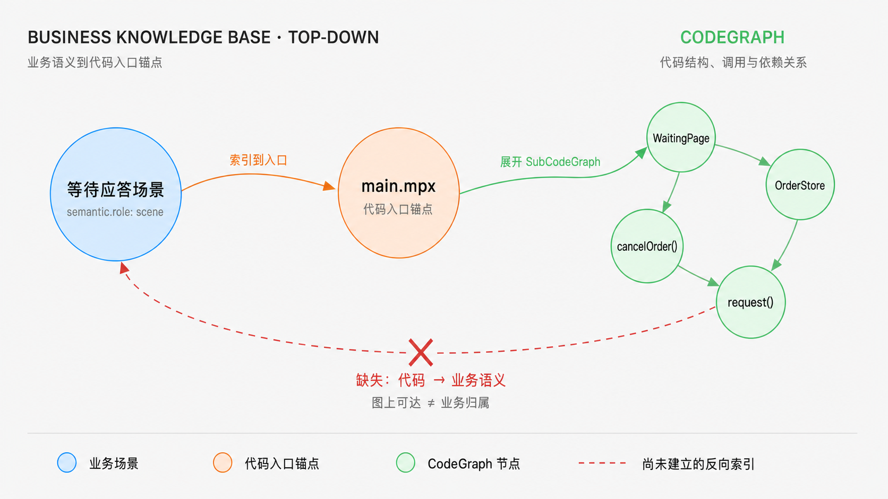
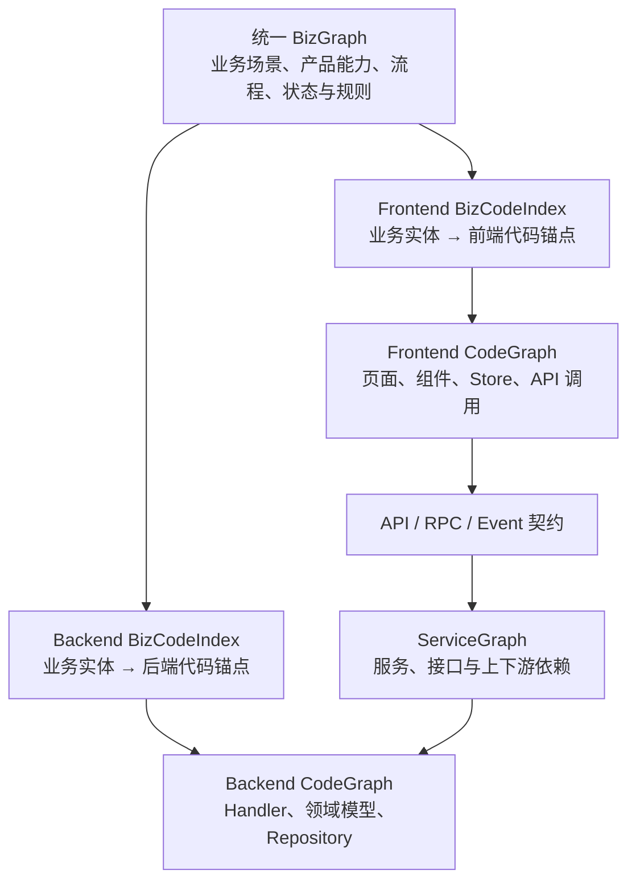

# 知识图谱构思与设计

## 从代码 RAG 的 Top-down 检索到双向追溯

在之前分享的[《知识图谱：聊聊代码 RAG》](./RAG.md)中，主要讨论了两个问题：

- 以 Mindwiki、CodeGraph、Graphify 为代表的 CKS 工具，能够描述代码 symbol、文件、模块之间的结构、调用和依赖关系，但缺少业务语义到代码实现的定位能力；
- 以乘客业务前端知识库为代表的 LLM Wiki 实践，通过补充业务场景、页面入口和模块边界，一定程度上建立了业务语义到代码位置的索引；

将 LLM Wiki 的索引机制与 CodeGraph 结合后，代码 RAG 可以从业务问题出发，逐层定位相关业务文档、代码入口、精确 symbol 及调用链：

**业务问题/业务语义 -> 业务文档 -> 代码入口锚点 -> 精确 symbol 与调用子图**

目前在前端场景下，业务知识库只建立了**业务语义 -> 代码入口位置**的索引。这里的代码入口更像是业务语义在代码空间中的一个**锚点**：它解决了“某个业务场景应该从哪里开始查找”的问题，但并未把业务语义与入口背后的具体代码符号、文件、模块及其依赖关系关联起来。

CodeGraph 可以补齐从“代码入口”到“代码结构”的查询能力。将业务知识库定位到的入口映射为 CodeGraph 中的节点后，可以从该节点展开对应的 SubCodeGraph，进一步获得相关 symbol、组件、文件、模块以及它们之间的调用和依赖关系。因此，两者在 Top-down 查询中的定位分别是：**业务知识库负责提供业务语义锚点，CodeGraph 负责围绕锚点扩展代码结构**。二者在查询时串联出一条路径：**业务语义 -> 代码入口锚点 -> 相关代码子图**。

但这种查询时的串联，并不意味着业务知识库与 CodeGraph 已经建立了完整的双向关系。业务知识库不知道入口子图中每个代码节点的业务归属，CodeGraph 也不理解入口及其下游节点承载的业务语义。将任意代码节点反向遍历到某个入口在技术上或许可行，但“图上可达”并不等于“被该业务使用”：公共组件可能同时被多个场景复用，调用链也可能跨越业务边界。若每次查询都需要枚举所有业务入口、动态计算子图并让 LLM 判断归属，不仅成本高，也难以保证结果稳定、准确和可校验。



图中业务知识库只将“等待应答场景”映射到 `main.mpx` 入口，CodeGraph 再从入口展开具体代码子图；红色虚线表示尚未显式建立的“代码 -> 业务语义”反向索引。

而在实际研发和代码治理过程中，还存在一类方向相反的查询：

- 某个 symbol、文件或功能模块被哪些业务场景使用？
- 修改一个公共组件，会影响哪些产品功能和业务流程？
- 某个 API 或后端服务，最终承载了哪些前端场景？

即：**从具体代码、模块或服务出发，反向定位其所属或影响的业务场景**。目前“业务知识库 + CodeGraph”的简单组合并不能可靠地回答这类问题；它不能只依靠 LLM 在查询时临时理解文档，而要求代码节点与业务实体之间存在稳定、明确且可反向查找的关系。

因此，代码 RAG 只是知识图谱在查询与消费层的一种实现机制，也主要实现了知识图谱查询场景中的一部分。要同时支持 Top-down 的“业务找代码”和 Bottom-up 的“代码找业务”，就需要把原本隐含在文档中的业务实体、代码锚点和关联关系显式化，形成可以双向查询和持续校验的知识图谱。

由此引出本文要讨论的问题：**如何将当前主要面向 LLM 召回的业务知识库 + CodeGraph，演进为同时服务业务、产品、研发、LLM 和工程系统，并支持双向追溯的知识体系？**

## 双向追溯需要怎样的知识组织

### 当前前端业务知识库：面向 LLM 的页面实现知识

现有业务知识库以 LLM Wiki 的 Markdown 文档为主要载体，它的组织目标首先是帮助 LLM 完成业务语义召回和上下文理解（当前业务知识库里业务语义到代码的索引只是里面很薄的一层内容，主要是技术架构、编码约束等指导 LLM 如何按规范编码）。文档通过自然语言描述业务背景、页面入口、模块边界和代码位置；即使不同文档的格式不完全一致，LLM 仍可以依靠上下文理解其中的含义。这种方式已经能够较好地支持业务问答和代码 RAG。

#### 现有文档层级

以 `mp-apphome-baseline/docs/biz` 为例，当前知识库整体按“业务索引 -> 页面文档 -> 模块文档 -> 源码”的路径组织：

| 层级 | 主要内容 | 实际视角 |
| --- | --- | --- |
| `docs/biz/index.md` | 将业务阶段、业务场景或产品页面映射到页面唯一 ID、主实现文件和页面文档 | 一层较薄的业务语义导航，用于回答“这个场景从哪个页面开始看” |
| `docs/biz/pages/*.md` | 页面激活条件、入口文件、页面结构、组件组成、接口调用、状态数据和 Store | 以产品页面为边界，解释页面如何承接和实现业务 |
| `docs/biz/modules/*.md` | 容器、组件、子模块及其文件路径、接口和数据流 | 面向前端模块的代码结构拆解 |
| `docs/biz/stores/*.md` | state、getter、action、接口返回和跨组件共享状态 | 面向前端状态管理和实现细节 |

例如，“平台等待应答 1.x”页面文档先用一小段内容说明其业务阶段和激活条件，随后主要围绕页面容器、入口组件、组件列表、调用接口、Store、Provide 和状态流转展开。由此可见，当前业务知识库虽然包含业务语义，但其核心组织单元仍然是**前端页面及其实现结构**。

因此，更准确的定位是：当前业务知识库是一种“**薄业务语义层 + 面向前端页面的代码拆解层**”。它非常适合 LLM 或研发从业务问题快速进入前端页面，再继续理解组件、接口和状态数据；但它还不是一套独立于前端实现结构的业务知识模型：业务场景、产品功能、流程和规则尚未被定义为具有稳定 ID 和明确关系的独立实体，也缺少跨页面、跨端以及代码到业务的反向组织能力。

### BKS：面向业务域的分层语义建模

BKS 从业务和产品视角出发，将用户旅程、用户诉求、产品选择、页面承接、用户功能和复用机制分别抽象为 Stage、Scenario、Category、Page、Feature 和 Capability 等业务实体，再通过具有明确语义的边描述实体之间的包含、归属、依赖、承接和呈现关系，由此构建 BizGraph。

BizGraph 本身是一个有层次、同时允许跨层关联的多维业务语义图：Stage 包含或关联 Page，Scenario 可以跨越多个 Stage 并由多个 Page 承接，Page 暴露 Feature，Scenario 依赖 Capability，Capability 又可以通过 Feature 呈现，Category 则在不同 Scenario 中提供差异化产品选择。这些层次并不构成一棵固定的目录树，同一实体可以参与多条跨层、多对多的业务关系。

| BKS 实体 | 定义 | 主要回答的问题 |
| --- | --- | --- |
| Stage | 一次用户旅程中的稳定大环节 | 用户现在处于旅程的哪一段？ |
| Scenario | 面向某类用户诉求形成的稳定业务链路 | 用户要解决什么问题，整条业务链路如何展开？ |
| Category | 具有独立定位和机制差异的产品选择 | 提供什么产品，为什么选择它？ |
| Page | 用户可以独立进入或停留的逻辑承接面 | 用户在哪个页面完成任务？ |
| Feature | 页面内用户可感知、可操作的功能位 | 用户具体看到或操作什么？ |
| Capability | 可跨页面复用或包含复杂策略的业务机制 | 业务依靠什么机制完成目标？ |

其中，BKS 中的 Page 可以理解为产品和用户视角下的**逻辑页面**，不能直接等同于前端代码文件。例如“等待应答页”“支付页”和“取消页”是不同的业务 Page，但它们可能共同映射到 `gulfstream/main.mpx` 这一物理实现入口。逻辑 Page 与代码页面之间的映射应由 BizCodeIndex 维护。

### BKS 与当前前端业务知识库的差异

当前前端业务知识库中也存在 Stage、Scenario 和 Page 等概念，但它们主要用于组织文档和缩短代码定位路径，而不是作为独立业务实体进行建模。其内容结构更接近一棵纵向展开的导航树：

```text
Stage / Scenario（业务分类与语义澄清）
  └─ Page（业务承接页面）
      ├─ 页面说明与激活条件
      ├─ 主实现文件 / 代码入口
      └─ Module / Component / Store / API
          └─ 源码
```

在这套结构中，Stage 和 Scenario 帮助 LLM 或研发理解“当前在讨论什么业务”，Page 则是连接业务问题与前端代码的关键索引节点。页面之下的内容很快进入组件、接口、状态和文件等实现细节。因此，它的核心目标是**澄清业务语义并定位代码入口**，Stage、Scenario、Page 之间的关系主要体现为文档分类和导航关系。

BKS 与前端业务知识库不是替代关系。BKS 负责回答业务的 **What/Why**，当前前端知识库负责回答前端实现的 **Where/How**。更合理的组合方式是：BKS 作为统一 BizGraph，前端页面文档引用其中的业务实体 ID；Frontend BizCodeIndex 再把 BKS 中的 Page、Feature 和 Capability 映射到现有页面文档、代码入口及 Frontend CodeGraph。这样可以保留前端知识库已有的实现细节，同时补齐稳定的业务语义层和 Bottom-up 反向关系。

BKS 使用了相似的业务概念，但组织方式不同。Stage、Scenario、Page、Feature 和 Capability 不再只是目录层级或页面文档中的字段，而是具有稳定身份的独立实体；**实体之间的关系本身也是需要维护和查询的知识**：

```text
Stage    ──包含/关联──> Page
Scenario ──由其承接──> Page
Page     ──提供──────> Feature
Scenario ──依赖──────> Capability
Capability ──呈现为──> Feature
Category ──适用于────> Scenario
```

因此，BKS 不是从一个业务分类逐层下钻到代码，而是在业务语义层连接不同实体：同一个 Page 可以属于某个 Stage、承接多个 Scenario，并提供多个 Feature；同一个 Capability 也可以被不同 Scenario 和 Page 复用。

两者真正的差异不是“是否包含 Stage、Scenario、Page”，而是这些概念承担什么作用：**前端业务知识库使用它们组织文档并建立通往代码的纵向索引，BKS 则将它们建模为节点，并以实体间关系构建 BizGraph**。

两者也不是替代关系。BKS/BizGraph 可以提供统一的业务实体和关系，当前前端业务知识库继续保留从逻辑 Page 到页面文档、代码入口和实现细节的纵向结构，再由 Frontend BizCodeIndex 将二者连接起来：

```text
BKS / BizGraph
  └─ Stage / Scenario / Page / Feature / Capability
                      │
                      │ Frontend BizCodeIndex
                      ▼
前端页面文档 → 代码入口 → Module / Component / Store / API → CodeGraph
```

<!-- ## BizGraph 的定位与建模粒度

BizGraph 不是业务文档之间的链接图，也不是给 CodeGraph 节点附加业务标签，而是对业务域本身的结构化表达。它为业务域、产品能力、业务场景、流程、状态、规则和角色等业务实体提供稳定身份，并描述它们之间的包含、触发、流转、依赖和约束关系。它主要回答“业务是什么、包含哪些能力、不同业务概念之间是什么关系”，而不直接描述这些能力如何由代码实现。

业务知识库与 BizGraph 也不是同一个概念：Markdown 是业务知识的编写和维护形态，BizGraph 是规范化 Markdown 经 Knowledge Compiler 解析后形成的结构化表示。因此，业务知识库可以同时服务人和 LLM，而 BizGraph 则为工程系统提供稳定、可查询的业务实体和关系。

### 用户功能是否需要进入 BizGraph

业务场景中的用户功能需要有选择地体现在 BizGraph 中。判断边界不是“它是否出现在页面上”，而是“它是否具有独立、稳定的业务含义”。例如等待应答场景中的“取消订单”“修改目的地”“联系客服”等功能，能够被用户感知、被产品独立命名，并可能关联业务规则、指标、实验、代码和服务，因此适合作为 `UserFeature` 或 `ProductCapability` 节点进入 BizGraph。

一个用户功能满足以下任一条件时，通常值得建成独立节点：

- 产品或业务人员会单独命名、讨论和维护它；
- 具有独立的业务规则、权限或状态生效条件；
- 具有独立的埋点、指标、实验或生命周期；
- 会被多个场景、页面或终端复用；
- 需要独立追溯到前端代码、API 或后端服务。

如果某个交互只服务于页面展示，没有独立规则，也不需要被检索或追溯，例如按钮颜色、展开动画、局部组件和内部工具函数，就不应进入 BizGraph，而应保留在产品文档、设计系统或 CodeGraph 中。如果某项功能具有业务含义但关系较少，也可以先作为场景的结构化属性；当它开始拥有独立规则、指标或跨场景关系时，再提升为独立节点。

以“等待应答”为例，可以形成如下业务关系：

```text
叫车流程
  └─ 包含 → 等待应答场景
               ├─ 提供 → 取消订单功能
               └─ 提供 → 查看寻找进度功能

取消订单功能
  ├─ 触发 → 取消订单流程
  ├─ 受约束于 → 取消规则
  ├─ 生效于 → 等待应答状态
  └─ 映射到 → 代码入口/API 锚点
```

因此，BizGraph 的最小有效粒度可以定义为：**具有稳定业务含义，能够被用户或产品感知，并且值得独立关联规则、指标、代码或服务的能力**。BizGraph 负责表达场景提供了什么业务能力；BizCodeIndex 负责把这些业务实体映射到代码锚点；CodeGraph 和 ServiceGraph 再分别描述其前端实现和后端服务依赖。 -->

## 业务域知识图谱的总体架构

站在一个完整业务域的视角，前端和后端不应该分别建设彼此独立的业务知识图谱。二者面对的是同一组业务场景、产品能力、流程、状态和规则，只是分别承担同一业务能力的不同实现部分。因此，整体架构应当以统一的 BizGraph 作为业务语义层，在其下分别建立前端和后端的 BizCodeIndex 与 CodeGraph，再通过 ServiceGraph 连接跨端接口和服务依赖。



各层的职责如下：

| 组成部分 | 核心职责 |
| --- | --- |
| BizGraph | 为整个业务域提供统一、稳定的业务实体和关系定义，不区分前端或后端实现 |
| Frontend BizCodeIndex | 将业务实体映射到前端页面、组件、状态和接口调用等代码锚点 |
| Backend BizCodeIndex | 将业务实体映射到后端 Endpoint、Handler、业务用例和领域规则等代码锚点 |
| Frontend CodeGraph | 描述前端代码内部 symbol、文件、模块、组件及调用依赖关系 |
| Backend CodeGraph | 描述后端服务内部 Handler、方法、领域模型、数据访问及事件关系 |
| ServiceGraph | 通过 API、RPC 和事件契约连接前端调用、后端服务及服务间依赖 |

这套架构包含两个相互补充的连接方向：

- **纵向语义对齐**：前端和后端分别通过自己的 BizCodeIndex，将统一 BizGraph 中的业务实体映射到各自的 CodeGraph。它解决“同一个业务能力分别由哪些前端和后端代码实现”的问题。
- **横向技术连接**：前端 CodeGraph 中的 API、RPC 或事件调用，通过契约和 ServiceGraph 连接到后端服务及其 CodeGraph。它解决“某次前端调用实际进入哪个服务、处理方法和下游依赖”的问题。

BizCodeIndex 和 ServiceGraph 在其中承担不同性质的桥接作用：**BizCodeIndex 是业务语义与技术实现之间的语义桥，ServiceGraph 是前后端实现及服务依赖之间的技术桥**。纵向和横向关系组合后，才能形成业务域内前后端一体化的端到端知识图谱。

以“取消订单”为例，BizGraph 中只需要维护一个统一的“取消订单功能”：前端 BizCodeIndex 将它映射到取消按钮、页面 Action 和接口调用，后端 BizCodeIndex 将它映射到 CancelOrder Endpoint、Handler 和取消规则；与此同时，ServiceGraph 再通过 CancelOrder API 将前端调用链与后端实现链连接起来。这样既可以从业务语义分别定位前后端实现，也可以沿真实技术调用关系完成跨端追溯。

### 业务语义与代码的双向可追溯

业务知识库与 CodeGraph 的结合，不只是建立一条从业务到代码的单向索引，而是在业务语义与代码结构之间建立**双向可追溯关系（Bidirectional Traceability）**：

- **业务 -> 代码（Top-down）**：从业务场景出发，经由代码入口锚点进入对应的代码子图，用于回答“这个业务由哪些代码实现”，解决语义检索、代码定位和上下文召回问题。
- **代码 -> 业务（Bottom-up）**：从某个 symbol、组件、文件或模块出发，反向查询它关联的代码子图及业务语义锚点，用于回答“这段代码被哪些业务场景消费”，解决业务归属识别、变更影响分析和代码治理问题。

因此，“双向索引”可以作为实现层面的描述，但从知识图谱的角度，更准确的定位是**业务—代码双向可追溯图谱**。它不是维护两套彼此独立的索引，而是基于同一组“业务语义 -> 入口锚点 -> 代码子图”关系，支持正向和反向两种图遍历。

目前在前端场景下，业务知识库只建立了**业务语义 -> 代码入口位置**的索引。这里的代码入口更像是业务语义在代码空间中的一个**锚点**：它解决了“某个业务场景应该从哪里开始看”的问题，但尚未把业务语义与入口背后的具体代码符号、文件、模块及其依赖关系关联起来。

CodeGraph 可以补齐从“代码入口”到“代码结构”的这一层关系。将业务知识库定位到的入口映射为 CodeGraph 中的节点后，可以从该节点展开对应的 SubCodeGraph，进一步获得相关 symbol、组件、文件、模块以及它们之间的调用和依赖关系。因此，两者在知识图谱中的定位分别是：**业务知识库负责提供业务语义锚点，CodeGraph 负责围绕锚点扩展代码结构**。二者结合后形成完整链路：**业务语义 -> 代码入口锚点 -> 相关代码子图**。

需要注意的是，CodeGraph 本身并不直接理解业务语义；具体代码节点的业务归属，是通过入口锚点与业务语义的连接而间接建立的。

### 从代码追溯扩展到业务域端到端追溯

前面描述的双向可追溯关系，主要解决业务语义、产品概念与前端代码之间的关联。但站在完整业务域的视角，仅有前端 CodeGraph 还不够：一次业务行为通常由前端页面和组件发起，经由接口调用进入后端服务，并可能继续依赖其他服务、数据和基础设施。

因此，还需要建立前端 CodeGraph 与后端 ServiceGraph 之间的关联。两者可以通过 **API、接口契约或服务端点**进行桥接：前端 CodeGraph 描述页面、组件、symbol、模块以及接口调用关系；ServiceGraph 描述接口对应的后端服务、处理方法及下游服务依赖。接口在这里与前面的代码入口类似，是连接前端代码子图和后端服务子图的**跨端锚点**。

由此可以形成一条端到端链路：**业务语义/产品概念 -> 前端页面或组件 -> API/接口契约 -> 后端服务 -> 下游服务与数据依赖**。这条链路同样支持反向追溯，例如从某个后端服务或接口出发，定位消费它的前端模块以及最终承载的业务场景。

从整体定位上看，前面的“业务—代码双向可追溯”是局部能力；将前端 CodeGraph 与后端 ServiceGraph 连接后，才进一步形成覆盖完整业务链路的**业务域端到端可追溯图谱（End-to-End Business Traceability Graph）**。

此外在泛前端的场景下，主包/分包、主仓库+npm package 的设计、MultiRepo 的场景等等；（索引的粒度）

## TODO

- [ ] 设计 Bottom-up 查询 Benchmark：构建一组从代码 symbol、文件、模块或 API 反向查询业务场景/产品功能的标准问题与人工标注答案，用于评估 BizCodeIndex 和知识图谱在代码业务归属识别上的准确率、召回率及关系完整性。
