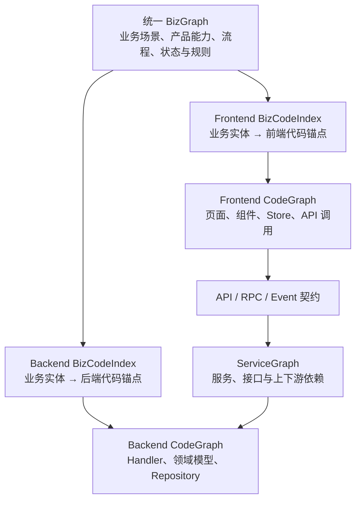

# 知识图谱构思与设计

以 Mindwiki/CodeGraph/Graphify 为代表的工具（CKG）核心解决的是代码符合间的结构、依赖关系。但是他们解决不了业务语义到代码入口、位置的索引关系。

## 业务知识库

以乘客业务为代表，基于 LLM Wiki 索引机制搭建的前端业务知识库一定程度上**弥补了 CKG 在业务语义 -> 代码定位能力的不足**。

### 乘客业务前端知识库

| 类别 | 代表 | 解决的问题 | 主要来源 |
| --- | --- | --- | --- |
| **业务知识库** | `docs/biz` | **业务场景是什么、页面入口在哪、模块边界是什么、接口/Store 怎么参与** | **人工校准** |
| 架构知识库 | `docs/architecture` | 系统分层、跨端机制、通信方式、分包规则、公共能力 | 人工校准 |
| 规范知识库 | `docs/coding-standards` | 怎么写代码、怎么提交、怎么测试 | 人工校准 |

### 业务知识库（docs/biz）

核心定位：**业务语义到代码索引层（桥接）**，面向 Agent / RD 的业务语义导航层和改代码前的定位工具，**不是源码替代物，也不是完整产品文档**。先用知识库理解业务语义、页面入口、模块边界、接口和状态流；再回源码验证并修改。文档负责缩短定位路径，源码仍然是最终事实。

1. **从业务问题快速定位源码**：`docs/biz/index.md`（line 1）是第一入口，把“预估、等应答、接驾、支付、评价、取消、场景页”等业务名映射到页面唯一 ID、主实现文件和页面文档。例如等应答 1.x 指到 `src/subpackage/gulfstream/gulfstream/pages/gulfstream/main.mpx` 和对应页面文档。
2. **解释一个页面的业务边界和激活条件**：页面文档会说明页面是什么、什么时候生效、入口组件在哪里。例如 gulfstream-hold-v1.x.md（line 3）明确等应答是 `waiting_page_type = 4/5`，并在同文档里说明入口组件、容器关系和子组件边界。
3. **拆解页面模块、接口、Store 和数据流**：页面文档不仅列文件，还列组件、接口调用、Store 依赖、Inject/Provide。比如 gulfstream-hold-v1.x.md（line 100）开始列核心接口，同文件（line 112）开始列 Store 和数据管理。
4. **补足“同一物理页面承载多个业务状态”的理解**：像 gulfstream 的 `main.mpx` 同时承载等待应答、接驾/送驾、支付、评价、取消等状态。容器文档 p-gulfstream.md（line 3）明确它是页面容器，通过订单状态切换不同业务面板。
5. **辅助判断代码组织和分包归属**：架构文档把业务层、业务公共层、公共依赖层、底层框架分开，并把 `docs/biz/index.md` 定位为业务层入口；同时 docs/architecture/index.md（line 58）指向分包设计，用来判断新功能应放主分包还是异步分包。

### 从 LLM Wiki 到可编译的业务知识

除了业务语义与代码结构之间的关系，目前两类知识在**组织形态和生产方式**上也是割裂的：

- 业务知识库以 LLM Wiki 的 Markdown 文档为主要载体，擅长表达业务背景、产品概念和场景语义，主要面向 LLM 和人阅读。
- CodeGraph 由静态分析、编译扫描等工程流程生成，以结构化数据和 API 的形式提供 symbol、文件、模块、调用及依赖关系，主要面向系统查询和工程消费。

这种割裂首先来自两类知识不同的设计目标和消费方式。现有业务知识库的目标是供 LLM 消费：自然语言表达即使格式不完全一致，LLM 仍可以依靠上下文和语义理解进行识别，因此文档通常只需要遵循面向人的编写约定，不要求像代码一样满足严格、确定且可校验的语法规范。CodeGraph 则面向编译器和工程系统消费，它要求输入和输出具有稳定的数据结构、明确的实体类型以及确定的关系定义，不能依赖对自然语言的模糊理解。

因此，问题并不是 Markdown 或自然语言完全没有结构，而是其中缺少一套可由机器强制校验的稳定契约。如果 Markdown 只是自由文本，或者仅有依赖作者自觉遵守的格式约定，那么即使其中写出了代码入口，工程系统也很难可靠地识别实体、关系和锚点；反过来，CodeGraph 虽然能精确描述代码结构，却无法从代码本身获得完整的业务语义。完整知识图谱的前提不是简单地把两份数据放在一起，而是为二者建立统一、可解析、可校验的**知识契约**。

一种更合适的设计是将业务知识定义为**可编译的业务知识（Compilable Business Knowledge）**，也可以理解为 **Knowledge as Code**：Markdown 不再只是最终展示文档，而是业务知识的语义源文件。通过约定统一的 Schema、Front Matter、稳定 ID、代码入口引用和关系类型，使同一份文档既保留适合 LLM 阅读的自然语言内容，也包含可被工程程序解析的结构化语义。

整体可以分为三层：

1. **知识编写层**：RD、产品或 LLM 按规范编写 Markdown，描述业务实体、业务场景、产品概念及其代码入口锚点。
2. **知识编译层**：Knowledge Compiler 解析和校验 Markdown，将业务实体及关系转换为结构化节点和边，并通过稳定 ID、文件路径或 symbol 与 CodeGraph 节点进行链接。
3. **知识服务层**：将业务知识图谱与 CodeGraph 组合，通过统一 API 同时提供语义检索、图查询、正向定位和反向追溯能力。

由此形成完整的知识生产链路：**规范化 Markdown -> Knowledge Compiler -> 业务知识图谱/BizCodeIndex -> CodeGraph -> 统一查询服务**。

在这个设计中，Markdown 是面向业务语义的**源代码和创作界面**，CodeGraph 是面向代码事实的**工程数据底座**，Knowledge Compiler 则负责把两者编译、校验和链接起来。这样既不牺牲 LLM Wiki 的可读性和低门槛，也不会让业务知识停留在无法被工程系统可靠消费的自由文本中。

### BizGraph 的定位与建模粒度

BizGraph 不是业务文档之间的链接图，也不是给 CodeGraph 节点附加业务标签，而是对业务域本身的结构化表达。它为业务域、产品能力、业务场景、流程、状态、规则和角色等业务实体提供稳定身份，并描述它们之间的包含、触发、流转、依赖和约束关系。它主要回答“业务是什么、包含哪些能力、不同业务概念之间是什么关系”，而不直接描述这些能力如何由代码实现。

业务知识库与 BizGraph 也不是同一个概念：Markdown 是业务知识的编写和维护形态，BizGraph 是规范化 Markdown 经 Knowledge Compiler 解析后形成的结构化表示。因此，业务知识库可以同时服务人和 LLM，而 BizGraph 则为工程系统提供稳定、可查询的业务实体和关系。

#### 用户功能是否需要进入 BizGraph

业务场景中的用户功能需要有选择地体现在 BizGraph 中。判断边界不是“它是否出现在页面上”，而是“它是否具有独立、稳定的业务含义”。例如等待应答场景中的“取消订单”“修改目的地”“联系客服”等功能，能够被用户感知、被产品独立命名，并可能关联业务规则、指标、实验、代码和服务，因此适合作为 `UserFeature` 或 `ProductCapability` 节点进入 BizGraph。

一个用户功能满足以下任一条件时，通常值得建成独立节点：

- 产品或业务人员会单独命名、讨论和维护它；
- 具有独立的业务规则、权限或状态生效条件；
- 具有独立的埋点、指标、实验或生命周期；
- 会被多个场景、页面或终端复用；
- 需要独立追溯到前端代码、API 或后端服务。

如果某个交互只服务于页面展示，没有独立规则，也不需要被检索或追溯，例如按钮颜色、展开动画、局部组件和内部工具函数，就不应进入 BizGraph，而应保留在产品文档、设计系统或 CodeGraph 中。如果某项功能具有业务含义但关系较少，也可以先作为场景的结构化属性；当它开始拥有独立规则、指标或跨场景关系时，再提升为独立节点。

以“等待应答”为例，可以形成如下业务关系：

```text
叫车流程
  └─ 包含 → 等待应答场景
               ├─ 提供 → 取消订单功能
               └─ 提供 → 查看寻找进度功能

取消订单功能
  ├─ 触发 → 取消订单流程
  ├─ 受约束于 → 取消规则
  ├─ 生效于 → 等待应答状态
  └─ 映射到 → 代码入口/API 锚点
```

因此，BizGraph 的最小有效粒度可以定义为：**具有稳定业务含义，能够被用户或产品感知，并且值得独立关联规则、指标、代码或服务的能力**。BizGraph 负责表达场景提供了什么业务能力；BizCodeIndex 负责把这些业务实体映射到代码锚点；CodeGraph 和 ServiceGraph 再分别描述其前端实现和后端服务依赖。

## 业务域知识图谱的总体架构

站在一个完整业务域的视角，前端和后端不应该分别建设彼此独立的业务知识图谱。二者面对的是同一组业务场景、产品能力、流程、状态和规则，只是分别承担同一业务能力的不同实现部分。因此，整体架构应当以统一的 BizGraph 作为业务语义层，在其下分别建立前端和后端的 BizCodeIndex 与 CodeGraph，再通过 ServiceGraph 连接跨端接口和服务依赖。



各层的职责如下：

| 组成部分 | 核心职责 |
| --- | --- |
| BizGraph | 为整个业务域提供统一、稳定的业务实体和关系定义，不区分前端或后端实现 |
| Frontend BizCodeIndex | 将业务实体映射到前端页面、组件、状态和接口调用等代码锚点 |
| Backend BizCodeIndex | 将业务实体映射到后端 Endpoint、Handler、业务用例和领域规则等代码锚点 |
| Frontend CodeGraph | 描述前端代码内部 symbol、文件、模块、组件及调用依赖关系 |
| Backend CodeGraph | 描述后端服务内部 Handler、方法、领域模型、数据访问及事件关系 |
| ServiceGraph | 通过 API、RPC 和事件契约连接前端调用、后端服务及服务间依赖 |

这套架构包含两个相互补充的连接方向：

- **纵向语义对齐**：前端和后端分别通过自己的 BizCodeIndex，将统一 BizGraph 中的业务实体映射到各自的 CodeGraph。它解决“同一个业务能力分别由哪些前端和后端代码实现”的问题。
- **横向技术连接**：前端 CodeGraph 中的 API、RPC 或事件调用，通过契约和 ServiceGraph 连接到后端服务及其 CodeGraph。它解决“某次前端调用实际进入哪个服务、处理方法和下游依赖”的问题。

BizCodeIndex 和 ServiceGraph 在其中承担不同性质的桥接作用：**BizCodeIndex 是业务语义与技术实现之间的语义桥，ServiceGraph 是前后端实现及服务依赖之间的技术桥**。纵向和横向关系组合后，才能形成业务域内前后端一体化的端到端知识图谱。

以“取消订单”为例，BizGraph 中只需要维护一个统一的“取消订单功能”：前端 BizCodeIndex 将它映射到取消按钮、页面 Action 和接口调用，后端 BizCodeIndex 将它映射到 CancelOrder Endpoint、Handler 和取消规则；与此同时，ServiceGraph 再通过 CancelOrder API 将前端调用链与后端实现链连接起来。这样既可以从业务语义分别定位前后端实现，也可以沿真实技术调用关系完成跨端追溯。

### 业务语义与代码的双向可追溯

业务知识库与 CodeGraph 的结合，不只是建立一条从业务到代码的单向索引，而是在业务语义与代码结构之间建立**双向可追溯关系（Bidirectional Traceability）**：

- **业务 -> 代码（Top-down）**：从业务场景出发，经由代码入口锚点进入对应的代码子图，用于回答“这个业务由哪些代码实现”，解决语义检索、代码定位和上下文召回问题。
- **代码 -> 业务（Bottom-up）**：从某个 symbol、组件、文件或模块出发，反向查询它关联的代码子图及业务语义锚点，用于回答“这段代码被哪些业务场景消费”，解决业务归属识别、变更影响分析和代码治理问题。

因此，“双向索引”可以作为实现层面的描述，但从知识图谱的角度，更准确的定位是**业务—代码双向可追溯图谱**。它不是维护两套彼此独立的索引，而是基于同一组“业务语义 -> 入口锚点 -> 代码子图”关系，支持正向和反向两种图遍历。

目前在前端场景下，业务知识库只建立了**业务语义 -> 代码入口位置**的索引。这里的代码入口更像是业务语义在代码空间中的一个**锚点**：它解决了“某个业务场景应该从哪里开始看”的问题，但尚未把业务语义与入口背后的具体代码符号、文件、模块及其依赖关系关联起来。

CodeGraph 可以补齐从“代码入口”到“代码结构”的这一层关系。将业务知识库定位到的入口映射为 CodeGraph 中的节点后，可以从该节点展开对应的 SubCodeGraph，进一步获得相关 symbol、组件、文件、模块以及它们之间的调用和依赖关系。因此，两者在知识图谱中的定位分别是：**业务知识库负责提供业务语义锚点，CodeGraph 负责围绕锚点扩展代码结构**。二者结合后形成完整链路：**业务语义 -> 代码入口锚点 -> 相关代码子图**。

需要注意的是，CodeGraph 本身并不直接理解业务语义；具体代码节点的业务归属，是通过入口锚点与业务语义的连接而间接建立的。

### 从代码追溯扩展到业务域端到端追溯

前面描述的双向可追溯关系，主要解决业务语义、产品概念与前端代码之间的关联。但站在完整业务域的视角，仅有前端 CodeGraph 还不够：一次业务行为通常由前端页面和组件发起，经由接口调用进入后端服务，并可能继续依赖其他服务、数据和基础设施。

因此，还需要建立前端 CodeGraph 与后端 ServiceGraph 之间的关联。两者可以通过 **API、接口契约或服务端点**进行桥接：前端 CodeGraph 描述页面、组件、symbol、模块以及接口调用关系；ServiceGraph 描述接口对应的后端服务、处理方法及下游服务依赖。接口在这里与前面的代码入口类似，是连接前端代码子图和后端服务子图的**跨端锚点**。

由此可以形成一条端到端链路：**业务语义/产品概念 -> 前端页面或组件 -> API/接口契约 -> 后端服务 -> 下游服务与数据依赖**。这条链路同样支持反向追溯，例如从某个后端服务或接口出发，定位消费它的前端模块以及最终承载的业务场景。

从整体定位上看，前面的“业务—代码双向可追溯”是局部能力；将前端 CodeGraph 与后端 ServiceGraph 连接后，才进一步形成覆盖完整业务链路的**业务域端到端可追溯图谱（End-to-End Business Traceability Graph）**。

此外在泛前端的场景下，主包/分包、主仓库+npm package 的设计、MultiRepo 的场景等等；（索引的粒度）
