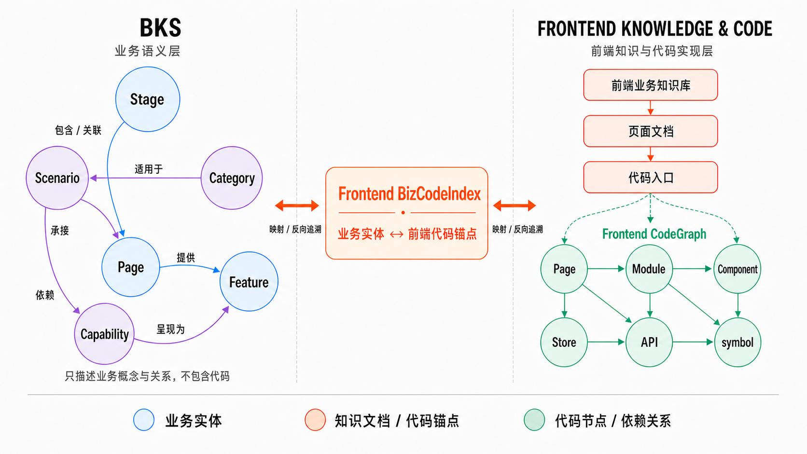

# 知识图谱设计

近期学习了乘客后端业务知识图谱的设计，也结合前端业务知识库和 CodeGraph 的相关实践，整理了一些对业务知识组织与知识图谱设计的思考。

## 第一部分：业务知识的两种组织方式

### BKS(Biz Knowledge System)：面向业务域构建业务知识图谱

BKS 从业务和产品视角出发，将用户旅程、用户诉求、产品选择、页面承接、用户功能和复用机制分别抽象为 Stage、Scenario、Category、Page、Feature 和 Capability 等业务实体，再通过具有明确语义的边描述实体之间的包含、归属、依赖、承接和呈现关系，由此构建业务知识图谱。

| BKS 实体 | 定义 | 主要回答的问题 |
| --- | --- | --- |
| Stage | 一次用户旅程中的稳定大环节 | 用户现在处于旅程的哪一段？ |
| Scenario | 面向某类用户诉求形成的稳定业务链路 | 用户要解决什么问题，整条业务链路如何展开？ |
| Category | 具有独立定位和机制差异的产品选择 | 提供什么产品，为什么选择它？ |
| Page | 用户可以独立进入或停留的逻辑承接面 | 用户在哪个页面完成任务？ |
| Feature | 页面内用户可感知、可操作的功能位 | 用户具体看到或操作什么？ |
| Capability | 可跨页面复用或包含复杂策略的业务机制 | 业务依靠什么机制完成目标？ |

BKS 不是把六类实体平铺在同一层，而是一个**具有层次、同时允许跨层关联的多维业务语义图**：

~~~text
Stage      ──包含/关联──> Page
Scenario   ──由其承接──> Page
Page       ──提供──────> Feature
Scenario   ──依赖──────> Capability
Capability ──呈现为────> Feature
Category   ──适用于────> Scenario
~~~

Stage 构成用户旅程骨架；Scenario 和 Category 描述业务组织与产品差异；Page 和 Feature 描述产品体验如何承接业务；Capability 描述支撑场景和功能的可复用业务机制。这些层次并不构成一棵固定的目录树，同一个 Page 可以属于某个 Stage、承接多个 Scenario 并提供多个 Feature，同一个 Capability 也可以被不同 Scenario 和 Page 复用。

需要明确的是，BKS 只描述业务域内的概念及其关系，并不涉及这些业务实体由哪些前端或后端代码实现。代码文件、模块、symbol 和服务接口不属于这一图层；业务实体与各端代码之间的映射由后续的 BizCodeIndex 承担，并进一步连接各自的 CodeGraph。

BKS 中的 Page 是产品和用户视角下的**逻辑页面**，不能直接等同于前端代码文件。例如“等待应答页”“支付页”和“取消页”是不同的业务 Page，但它们可能共同映射到 gulfstream/main.mpx 这一物理实现入口。

### 前端业务知识库：面向业务语义到代码的纵向索引

在之前分享的[《知识图谱：聊聊代码 RAG》](./RAG.md)中，前端业务为了解决业务语义到代码定位的问题，参考 LLM wiki 的索引机制，以 md 文档为主要载体，来辅助 LLM 澄清业务语义、并索引到前端代码的入口位置。

当然，在知识库中也存在 Stage、Scenario 和 Page 这些和后端的业务知识图谱相同的概念，但在实际的知识库文档里面并不会体现这一层的抽象设计，因为前端业务知识库的定位并不是构建这些业务实体的关系，而是做业务语义 -> 代码的澄清和索引。

为了让 LLM 更方便的理解页面的结构设计，业务语义和代码间的关系。

因此，它更接近“**薄业务语义层 + 面向前端页面的代码拆解层**”。

它的内容结构更接近一棵纵向展开的导航树：

~~~text
Stage / Scenario（业务分类与语义澄清）
  └─ Page（业务承接页面）
      ├─ 页面说明与激活条件
      ├─ 主实现文件 / 代码入口
      └─ Module / Component / Store / API
          └─ 源码
~~~

<!-- 以 mp-apphome-baseline/docs/biz 为例，知识库按“业务索引 -> 页面文档 -> 模块/Store 文档 -> 源码”的路径组织：

| 层级 | 主要内容 | 实际作用 |
| --- | --- | --- |
| docs/biz/index.md | 将业务阶段、场景或产品页面映射到页面唯一 ID、主实现文件和页面文档 | 回答“这个业务从哪个页面开始看” |
| docs/biz/pages/*.md | 页面激活条件、入口文件、页面结构、组件、接口和状态数据 | 解释页面如何承接业务 |
| docs/biz/modules/*.md | 容器、组件、子模块、文件路径和数据流 | 拆解前端模块结构 |
| docs/biz/stores/*.md | state、getter、action、接口返回和共享状态 | 解释前端状态与数据流 | -->

### BKS 与当前前端业务知识库的定位与衔接

放到整个知识图谱的架构设计中来看，**BKS 与当前前端业务知识库所处的层级不同，承担的职责也不一样**：

- **BKS** 将业务概念建模为节点，实体之间的关系本身就是需要维护和查询的知识，回答“业务由什么构成、不同业务实体如何关联”；
- **前端业务知识库** 使用业务概念组织文档，并建立从业务分类、页面到前端代码实现的纵向索引，回答“业务在前端由什么页面承接、具体在哪里实现”。

两者的联系在于，**前端业务知识库可以沿用 BKS 中统一定义的业务实体，并建立和代码位置之间的索引关系**。

图中 BKS 只维护统一的业务实体及其关系；Frontend BizCodeIndex 负责建立业务实体与前端代码锚点之间的映射，并支持反向追溯；前端业务知识库保留从页面文档到代码入口的纵向导航，Frontend CodeGraph 则从代码入口继续展开具体的代码节点和依赖关系。

## 第二部分：从问题出发看前端业务知识库的扩展

在[《知识图谱：聊聊代码 RAG》](./RAG.md)中，讨论了如何沿着“业务语义 -> 代码入口 -> symbol 与调用链”定位代码。但放到完整知识图谱中来看，当前方案还留下两个问题：能从业务找到代码，却难以从代码反查业务；前端代码关系停留在 API 调用，尚未连接到真实的后端服务。

### 问题一：代码无法稳定反查业务归属

当前业务知识库与 CodeGraph 已经可以支持 Top-down 查询：

**业务语义 -> 业务文档 -> 代码入口锚点 -> symbol 与调用子图**

但业务知识库的索引边界通常只到代码入口，CodeGraph 又不理解业务语义，因此无法直接回答“某个 symbol、模块或 API 被哪些业务场景使用”。

这类 Bottom-up 查询包括：

- 某个 symbol、文件或功能模块被哪些业务场景使用？
- 修改一个公共组件，会影响哪些产品功能和业务流程？
- 某个 API 或后端服务，最终承载了哪些前端业务场景？

“图上可达”也不等于“被该业务使用”：公共组件可能被多个场景复用，调用链也可能跨越业务边界，不能在查询时临时交给 LLM 判断。

**解法是建立 Frontend BizCodeIndex**，显式连接 BKS 业务实体、前端代码锚点及其相关代码节点，使同一组关系支持双向查询：

- **业务 -> 代码（Top-down）**：从 Stage、Scenario、Page、Feature 或 Capability 定位前端实现；
- **代码 -> 业务（Bottom-up）**：从 symbol、组件、文件、模块或 API 反查业务归属和影响场景。

这就是业务语义与代码的**双向可追溯关系（Bidirectional Traceability）**。

#### 落地手段：将业务—代码关系定义为可编译知识

要稳定构建 Frontend BizCodeIndex，不能只依赖 LLM 在查询时理解自然语言文档。当前前端业务知识主要以 Markdown 组织，虽然适合人和 LLM 阅读，但工程系统无法可靠识别其中的 BKS 实体、代码锚点及其关系。

因此，需要将关键关系定义为**可编译的业务知识**：前端不重复建设 BKS，而是在 Markdown 中通过稳定 ID 引用 BKS 实体，并用结构化字段声明代码锚点：

~~~yaml
---
bks_refs:
  stage: stage.waiting_for_response
  page: page.waiting_for_response
  features:
    - feature.cancel_order
  capabilities:
    - capability.cancel_retention

code_anchors:
  - repo: mp-apphome
    path: src/subpackage/gulfstream/gulfstream/pages/gulfstream/main.mpx
    symbol: GulfstreamPage
---
~~~

Markdown 正文继续承担业务解释，Front Matter 则作为机器可解析的知识契约。Knowledge Compiler 只需校验 BKS 实体和代码锚点是否存在，并据此生成 Frontend BizCodeIndex。这样既保留文档的可读性，也让关键关系能够被工程系统持续构建和校验。

### 问题二：前端代码关系无法延伸到后端服务

BKS 已经统一了前后端的业务语义，但两端的实现关系仍然分散在各自的 CodeGraph 中。Frontend CodeGraph 只能看到 API、RPC 或 Event 调用，无法继续定位真实的后端服务、代码实现和下游依赖。

**解法是分别建立前后端 BizCodeIndex，并通过 ServiceGraph 连接两端的 CodeGraph：**

~~~mermaid
flowchart TD
    B["统一 BKS Stage、Scenario、Page、Feature、Capability"]

    FBI["Frontend BizCodeIndex 业务实体 → 前端代码锚点"]
    BBI["Backend BizCodeIndex 业务实体 → 后端代码锚点"]

    FCG["Frontend CodeGraph 页面、组件、Store、API 调用"]
    BCG["Backend CodeGraph Endpoint、Handler、领域模型"]

    CONTRACT["API / RPC / Event 契约"]
    SG["ServiceGraph 后端服务、端点与上下游依赖"]

    B --> FBI --> FCG
    B --> BBI --> BCG
    FCG --> CONTRACT --> SG --> BCG
~~~

各图层的职责是：

- **BKS** 提供统一业务语义；
- **Frontend/Backend BizCodeIndex** 分别完成业务实体到前后端实现的纵向映射；
- **Frontend/Backend CodeGraph** 描述各自内部的精确代码结构；
- **ServiceGraph** 通过 API、RPC 或 Event 契约，将前端代码中的调用节点连接到后端服务及其依赖关系。

**业务实体 -> 前端页面/组件 -> API 调用 -> 后端服务/端点 -> 后端实现与下游依赖**

这条链路也支持反向查询：从后端服务出发，可以定位消费它的前端模块，并最终回到 BKS 中的业务场景。因此，前端业务知识库不需要重新建设 BKS，只需要完成两类连接：

1. 通过 Frontend BizCodeIndex 将统一业务语义连接到前端代码；
2. 通过 ServiceGraph 将前端代码调用连接到后端服务。

## TODO

- [ ] 设计 Bottom-up 查询 Benchmark：构建一组从代码 symbol、文件、模块或 API 反向查询业务场景/产品功能的标准问题与人工标注答案，用于评估 BizCodeIndex 和知识图谱在代码业务归属识别上的准确率、召回率及关系完整性。
