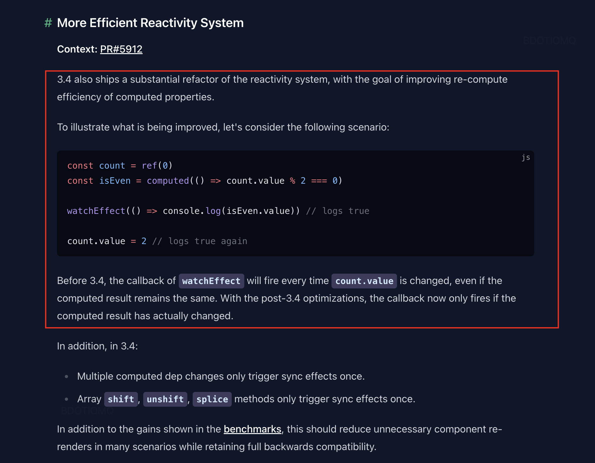
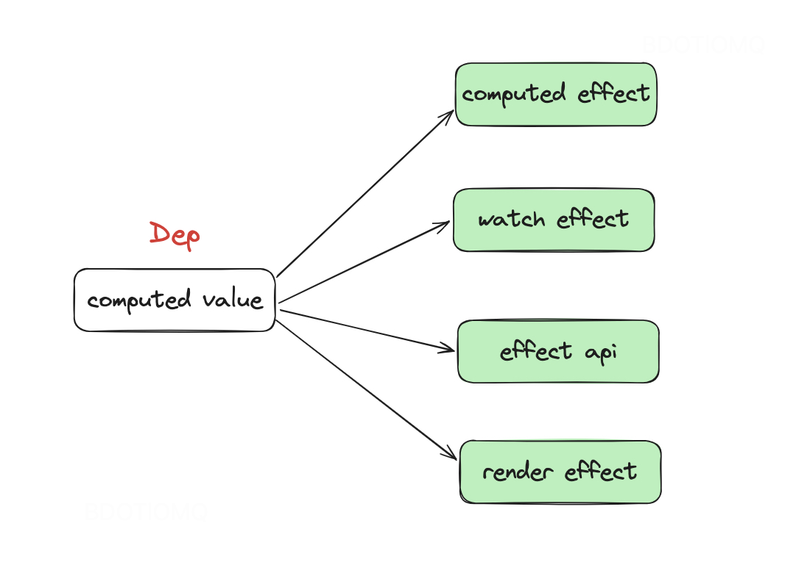
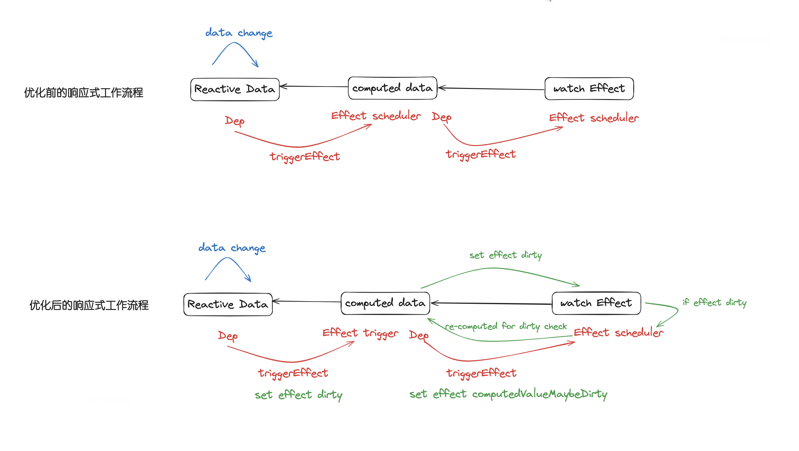

## Vue3.4 effect-drity-check 机制


### 框架现状

在最近刚发布的 Vue3.4 版本当中重构了部分响应式系统的功能。博客当中举了一个例子：



在之前的版本当中，`count.value` 发生变化的话，但是 `isEven.value` 不一定真正的发生了变化，但是仍然会再次触发 `watchEffect` 的执行。主要的原因还是在于之前的 computed effect 的[设计](https://github.com/vuejs/core/pull/5912/files#diff-95734490ac7bb277f876f1c6e635a2718f5f8ac75615d0d72403df5a8903e652L44)，computed 依赖的响应式数据发生了变化之后，computed effect scheduler 会立即触发对其产生依赖的 effect。所以在这个例子当中，count.value 发生了变化，触发 computed effect 进而也就触发了 watch effect 的执行。

由这个简单的例子可以继续推导下，在 Vue 框架内部基于 ReactiveEffect 封装了更加上层的响应式 api 的使用场景，包括：

* computed effect
* watch effect
* effect api
* render effect（组件渲染使用）

在不同的使用场景下，这些 effect 都可以和 computed 数据建立起依赖关系。



<!-- todo: 补充一个图 不同 effect 和 computed 数据之间的关系 -->

那么不管是以上哪种依赖关系， computed 数据在 re-computed 的过程当中都是可能会出现上述例子当中出现的：computed 数据的值实际没有变化，但是 effect 会重新执行的情况，从而导致了一些不必要的性能损耗。

那么为了优化这种场景，Vue3.4 引入了 effect dirty check 机制：

### ReactiveEffect 重构

首先来看下 ReactiveEffect 重构后几个大的变化：


* 对于使用方而言第二个参数改为必传的 `trigger` 函数（trigger 和 scheduler 之间的区别：trigger 要比 scheduler 先执行，提前派发一些信号，主要是用以 computed 数据的处理？）
* 内部新增了一个属性 `_dirtyLevel` 用以标记当前 effect 实例的 dirty [状态](https://github.com/vuejs/core/pull/5912/files#diff-f7360f435e9d5bfecbdfc36d9dbd7625cc99b76e6350f6522c2473d7441440c2R25)（区分了 computed 数据和普通的 reactive/ref 数据）
* 暴露了 dirty getter 用以判断当前 effect scheduler 是否真的需要重新触发


```javascript
export class ReactiveEffect {
  ...
  _dirtyLevel = DirtyLevels.Dirty
  ...

  constructor(
    public fn: () => T,
    public trigger: () => void,
    public scheduler?: EffectScheduler,
    scope?: EffectScope
  ) {
    recordEffectScope(this, scope)
  }

  public get dirty() {
    if (this._dirtyLevel === DirtyLevels.ComputedValueMaybeDirty) {
      this._dirtyLevel = DirtyLevels.NotDirty // computed 数据访问过一次后，置为 NotDirty
      this._queryings++ // 针对查询 computed 数据的设置（不涉及依赖关系的建立）
      pauseTracking() // 暂停依赖的收集
      for (const dep of this.deps) {
        if (dep.computed) {
          triggerComputed(dep.computed) // 访问存在依赖关系的 computed 数据，调用 computed value getter，看是否发生了变化，如果发生了变化，动态的改变当前依赖的 effect dirty 值，进而最终会执行 effect scheduler 
          if (this._dirtyLevel >= DirtyLevels.ComputedValueDirty) {
            break
          }
        }
      }
      resetTracking()
      this._queryings--
    }
    return this._dirtyLevel >= DirtyLevels.ComputedValueDirty
  }
}
```

### computed 重构

* trigger event，更新 effect dirty 为 ComputedValueMayBeDirty（仍然保持了 computed 的 lazy 特性）
* value 访问会判断 effect dirty 的状态，为 true 才会去重新执行 effect 并得到最新的数据，同时会对比新旧数据，如果发生了变化，那么就会 triggerEffects，实际上就是触发对其依赖的 effect

```javascript
export class ComputedRefImpl<T> {
  ...
  constructor() {
    this.effect = new ReactiveEffect(
      () => getter(this._value),
      () => triggerRefValue(this, DirtyLevels.ComputedValueMaybeDirty)
    )
  }
  get value() {
    const self = toRaw(this)
    trackRefValue(self)
    if (!self._cacheable || self.effect.dirty) {
      if (hasChanged(self._value, (self._value = self.effect.run()!))) {
        triggerRefValue(self, DirtyLevels.ComputedValueDirty)
      }
    }
    return self._value
  }
  ...
}
```

### triggerEffects 重构

* 更新 effect dirty 状态
* 触发 trigger
* 收集 effect scheduler（若有），在适当的时机会触发所有收集的 effect scheduler（一个数据发生变化后，确保整个数据依赖链路（包括effect ）都被遍历过）

```javascript
export function triggerEffects(
  dep: Dep,
  dirtyLevel: DirtyLevels
  ...
) {
  pauseScheduling() // 只能保证在当前 triggerEffects 的嵌套 triggerEffects 当中不会触发 effect scheduler 函数
  for (const effect of dep.keys()) {
    if (!effect.allowRecurse && effect._runnings) {
      continue
    }
    if (
      effect._dirtyLevel < dirtyLevel &&
      (!effect._runnings || dirtyLevel !== DirtyLevels.ComputedValueDirty) // runnings 当前 effect 是否正在执行
    ) {
      const lastDirtyLevel = effect._dirtyLevel
      effect._dirtyLevel = dirtyLevel
      if (
        lastDirtyLevel === DirtyLevels.NotDirty &&
        (!effect._queryings || dirtyLevel !== DirtyLevels.ComputedValueDirty)
      ) {
        if (__DEV__) {
          effect.onTrigger?.(extend({ effect }, debuggerEventExtraInfo))
        }
        effect.trigger() // 确保 computed trigger 先执行
        if (effect.scheduler) {
          queueEffectSchedulers.push(effect.scheduler)
        }
      }
    }
  }
  resetScheduling()
}
```

再回到 Blog 当中的例子，看下响应式数据发生变化后整个 effect 依赖关系触发流程重构前后的工作流程：



### 基于 ReactiveEffect 的上层封装

ReactiveEffect 是 `@vue/reactivity` 所暴露出**最重要最底层的用以搭建整个响应式系统的 api**，那么如果要基于 3.4 版本后的 ReactiveEffect 去封装上层的 api 有两点需要注意：

1. ReactiveEffect 接受的 trigger 函数为必传；
2. 可以在 effect scheduler 函数当中可以进行 effect dirty check 来决定 effect 是否需要执行用以提升性能；


<!-- 1. 具体的场景举例（和之前的工作流程的对比）；
   1. 具体会出现这种 case 的原因
2. 引入了 effect-dirty-check；
3. 如何去做的；
   1. ReactiveEffect API 的变化； trigger/scheduler 之间的区别（trigger 只是触发一些信号，即 computed 触发相关依赖的执行，scheduler 好理解，是交给用户来决定怎么去触发 effect）
   2. dity-check 机制；
4. 对于基于 ReactiveEffect 做上层 API 的一些改造工作。 -->