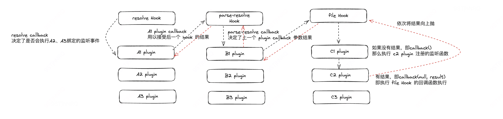

首先从概念和用途上有个直观的感受就是 `resolver` 实例提供了供你寻址的一些方法来解析文件路径，找到对应的文件地址。

在 webpack 整个技术架构当中，将寻址的功能单独抽离了一个 package：`enhance-resolve`。 webpack 将 `enhance-resolve` 作为底层的能力，上层封装了 `ResolverFactory` 来实例化具体的 `resolver` 对象。

```javascript
// lib/ResolverFactory.js
const Factory = require('enhanced-resolve').ResolverFactory

module.exports = class ResolverFactory {
  ...
  get(type, resolveOptions) {
    ...
    const newResolver = this._create(type, resolveOptions)
    ...
    return newResolver
  }

  _create(type, resolveOptionsWithDepType) {
    ...
    const resolver = Factory.createResolver(resolveOptions) // 创建 resolver 实例
    ...
    this.hooks.resolver
      .for(type)
      .call(resolver, resolveOptions, originalResolveOptions)
    return resolver
  }
}
```

resolver 从类型上区分一共有3种（**它们之间的区别主要是在解析的配置不同，解析配置不同对应的 resolver 功能和行为也有比较大的不同**，但是寻址的流程，也就是 enhance-resolve 的流程是一致的）：

* normal resolver
* context resolver
* loader resolver

### createResolver

创建 resolver 实例的过程当中，一方面是解析配置，这些配置也决定了当前这个 resolver 的功能和行为。

此外，就是在 resolver 实例上初始化一系列的 hook 以及内置 resolver 插件和外部传入的插件：

```javascript
exports.createResolver = function(options) {
  const normalizedOptions = createOptions(options)
  ...

  const plugins = userPlugins.slice()

  const resolver = customResolver
    ? customResolver
    : new Resolver(fileSystem, normalizedOptions)

  resolver.ensureHook('resolve')
  resolver.ensureHook('internalResolve')
  ....

  // 内置插件的初始化
  plugins.push(
    new DescriptionFilePlugin(
      'undescribed-resolve-in-package',
      descriptionFiles,
      false,
      'resolve-in-package'
    )
  )

  ...
  plugins.push(
    new NextPlugin('resolve-in-package', 'resolve-in-existing-directory')
  )
  ...

  // 外部插件的初始化
  for (const plugin of plugins) {
    if (typeof plugin === 'function') {
      (plugin).call(resolver, resolver)
    } else if (plugin) {
      plugin.apply(resolver)
    }
  }

  return resolver
}
```

初始化 resolver 实例后，调用  `resolver.resolve` 方法会正式开启寻址的流程。

```javascript
/**
* @param {object} context context information object
* @param {string} path context path
* @param {string} request request string
* @param {ResolveContext} resolveContext resolve context
* @param {ResolveCallback} callback callback function
* @returns {void}
*/
resolve(context, path, request, resolveContext, callback) {
  ...

  const finishResolved = result => {
    return callback(
      null,
      result.path === false
        ? false
        : ...,
      result
    )
  }

  return this.doResolve(
    this.hooks.resolve,
    obj,
    message,
    {
      ...
    },
    (err, result) => {
      ...
      if (result) return finishResolved(result)

      return finishWithoutResolve(log)
    }
  )
}
```

### 插件设计

对于每次的寻址过程来说，基本的调度流程节点是一致的（pipeline hooks），但是具体的调度时机是由插件来决定的。

插件一般至少会接受2个参数，一个是初始监听的 source hook，另外一个是接下来触发的 target hook。


对于 source hook 而言，在插件初始化的过程中就完成了监听，**这也意味着你可以通过插件去 hook 到调度流程的各个节点当中，同时还可以基于现有的调度的流程去拓展新的流程**。

target hook 的触发也就是进入到下一个调度流程的 hook 当中，也就是由其他插件监听的 target hook 进行触发。

在这两者之间你可以按需去改变 resolve 相关的信息。

不过对于每个 hook 而言，不管是 source hook 还是 target hook 的类型都是预设好的，统一都是 `AsyncSeriesBailHook`：

```javascript
class Resolver {
  ...
  ensureHook(name) {
    name = toCamelCase(name)
    if (/^before/.test(name)) {
      return this.ensureHook(name[6].toLowerCase() + name.slice(7)).withOptions({
        stage: -10
      })
    }

    if (/^after/.test(name)) {
      return this.ensureHook(name[5].toLowerCase() + name.slice(6)).withOptions({
        stage: -10
      })
    }

    const hook = this.hooks[name]
    if (!hook) {
      this.hooks[name] = new AsyncSeriesBailHook(
        ['request', 'resolveContext'],
        name
      )

      return this.hooks[name]
    }

    return hook
  }
}
```

注：`withOptions` 方法接受 options 配置参数是 tapable hook 提供了用以改变当前 hook 一些行为的高阶方法。这里 resolver 也提供了针对同一个 hook 通过 `before-xx`/`after-xx` 来约定针对同一个 hook 不同回调函数触发的时机（stage）。

### 流程设计

对于一个 resolver 来说由 `resolver.resolve` 方法来启动整个解析路径的流程。其实也就对应到内部的 resolve hook 的触发，接下来也就交由一系列的插件来接管整个流程控制。

上图示意了整个插件调度的大致流程：



1. resolve hook 的启动会触发 A1 plugin 监听这个 hook 的回调函数，那么 resolve hook callback 会在下一个 hook 的回调当中来决策后续的流程应该怎么执行：例如 A1 plugin 对应的 target hook 是 parse-resolve hook，这个 hook 触发后的回调也就决定了上一个 hook callback 的执行动作。一旦在某个插件的 callback 里面获取到了结果，可以将参数传入到 hook callback 当中，整个的 callback 也就会逆向的执行（图中红色的流程线），最终回到 resolve hook 的 callback 当中，业务代码当中也就获取到了正确的结果。
2. 在上面也提到了所有的 hook 类型都是 AsyncSeriesBailHook，对于一个 hook 来说可以有多个监听函数，例如上图中，针对 file Hook 有3个插件都监听了，当 B1 插件触发 file Hook 时，优先响应 c1 插件的监听函数(stage 更小)，如果 c1 插件没有获取到正确的结果，直接调用 `callback()` 也就意味着执行下一个监听函数（对应到 c2 plugin），在 c2 plugin 当中获取到正确的结果后 `callback(null, result)` 也就意味着 file Hook 的回调函数会被触发，也就不会执行 c3 plugin 的监听函数了，然后也就逆向的执行相关 hook callback。