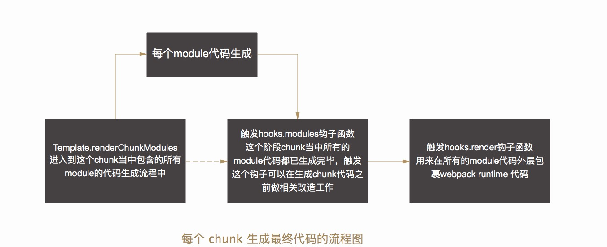
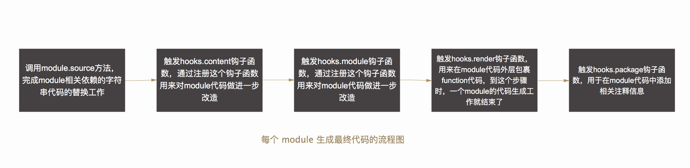
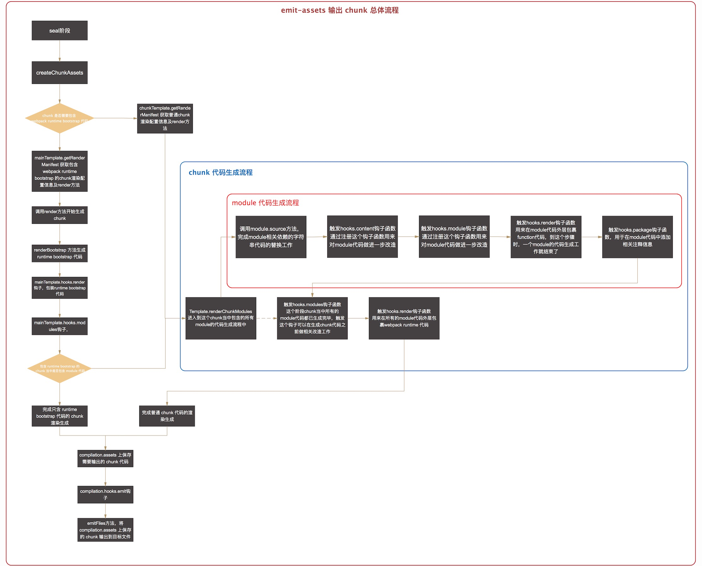

## 文件输出

上篇文章主要是梳理了有关 chunk 是如何分析其依赖，以及如何将有依赖关系的 module 统一组织到一个 chunk 当中的。接下来在 seal 阶段又会进行各种相关的优化工作，例如给所有需要输出成文件的 chunk 分配 id 值，以及给 chunk 当中包含的 module 分配 id 值等等工作。

其中在这些优化工作完成后会调用 createChunkAssets 方法来决定最终输出到每个 chunk 当中对应的文本内容是什么。

```javascript
// Compilation.js

class Compilation extends Tapable {
	...
	createChunkAssets() {
		for (let i = 0; i < this.chunks.length; i++) {
			const chunk = this.chunks[i]
			try {
				const template = chunk.hasRuntime()
					? this.mainTemplate
					: this.chunkTemplate;
				const manifest = template.getRenderManifest({
					chunk,
					hash: this.hash, // 这次 compilation 的 hash 值
					fullHash: this.fullHash, // 这次 compilation 未被截断的 hash 值
					outputOptions,
					moduleTemplates: this.moduleTemplates,
					dependencyTemplates: this.dependencyTemplates
				}); // [{ render(), filenameTemplate, pathOptions, identifier, hash }]
				for (const fileManifest of manifest) {
					...
					fileManifeset.render() // 渲染生成每个 chunk 最终输出的代码
					...
				}
			}
			....
		}
	}
	...
}
```

在 createChunkAssets 方法内部会对最终需要输出的 chunk 进行遍历，根据这个 chunk 是否包含有 webpack runtime 代码来决定使用的渲染模板(mainTemplate/chunkTemplate)。其中 mainTemplate 主要用于包含 webpack runtime bootstrap 的 chunk 代码渲染生成工作，chunkTemplate 主要用于普通 chunk 的代码渲染工作。我们首先来看下包含有 webpack runtime 代码的 chunk 是如何输出最终的 chunk 文本内容的。

### mainTemplate 渲染生成包含 webpack runtime bootstrap 代码的 chunk


这种情况下使用的 mainTemplate，调用实例上的 getRenderManifest 方法获取 manifest 配置数组，其中每项包含的字段内容为:

```javascript
// MainTemplate.js
class MainTemplate extends Tapable {
	...
	getRenderManifest(options) {
		const result = [];

		this.hooks.renderManifest.call(result, options);

		return result;
	}
	...
}
```

getRenderManifeset 方法内部实际上是触发了 JavascruotModulesPlugin 内部注册的 hooks.renderManifest 钩子函数：

```javascript
// JavascriptModulesPlugin.js
class JavascriptModulesPlugin {
	apply(compiler) {
		compiler.hooks.compilation.tap(
			'JavascriptModulesPlugin',
			(compilation, { normalModuleFactory }) => {
				compilation.mainTemplate.hooks.renderManifest.tap('JavascriptModulesPlugin', () => {
					...
					result.push({
						render: () =>
							// 这个 chunk 最终会调用这个 render 函数去完成文本的输出工作
							compilation.mainTemplate.render(
								hash,
								chunk,
								moduleTemplates.javascript,
								dependencyTemplates
							),
						filenameTemplate,
						pathOptions: {
							noChunkHash: !useChunkHash,
							contentHashType: 'javascript',
							chunk
						},
						identifier: `chunk${chunk.id}`, // 使用 chunk.id 来作为当前 chunk 的标识符
						// 使用 chunkHash 还是这次 compilation 编译的 hash 值，判断的依据为 output 当中的配置是否包含 hash
						hash: useChunkHash ? chunk.hash : fullHash
					})
					...
				})
			})
	}
}
```

接下来会判断这个 chunk 是否有被之前已经输出过(输出过的 chunk 是会被缓存起来的)。如果没有的话，那么就会调用 render 方法去完成这个 chunk 的文本输出工作，即：`compilation.mainTemplate.render`方法。

```javascript
// MainTemplate.js

module.exports = class MainTemplate extends Tapable {
	...
	constructor() {
		// 注册 render 钩子函数
		this.hooks.render.tap(
			"MainTemplate",
			(bootstrapSource, chunk, hash, moduleTemplate, dependencyTemplates) => {
				const source = new ConcatSource();
				source.add("/******/ (function(modules) { // webpackBootstrap\n");
				source.add(new PrefixSource("/******/", bootstrapSource));
				source.add("/******/ })\n");
				source.add(
					"/************************************************************************/\n"
				);
				source.add("/******/ (");
				source.add(
					// 调用 modules 钩子函数，用以渲染 runtime chunk 当中所需要被渲染的 module
					this.hooks.modules.call(
						new RawSource(""),
						chunk,
						hash,
						moduleTemplate,
						dependencyTemplates
					)
				);
				source.add(")");
				return source;
			}
		);
	}
  ...
  /**
	 * @param {string} hash hash to be used for render call
	 * @param {Chunk} chunk Chunk instance
	 * @param {ModuleTemplate} moduleTemplate ModuleTemplate instance for render
	 * @param {Map<Function, DependencyTemplate>} dependencyTemplates dependency templates
	 * @returns {ConcatSource} the newly generated source from rendering
	 */
	render(hash, chunk, moduleTemplate, dependencyTemplates) {
		// 生成 webpack runtime bootstrap 代码
		const buf = this.renderBootstrap(
			hash,
			chunk,
			moduleTemplate,
			dependencyTemplates
		);
		// 调用 render 钩子函数
		let source = this.hooks.render.call(
			new OriginalSource(
				Template.prefix(buf, " \t") + "\n",
				"webpack/bootstrap"
			),
			chunk,
			hash,
			moduleTemplate,
			dependencyTemplates
		);
		if (chunk.hasEntryModule()) {
			source = this.hooks.renderWithEntry.call(source, chunk, hash);
		}
		if (!source) {
			throw new Error(
				"Compiler error: MainTemplate plugin 'render' should return something"
			);
		}
		chunk.rendered = true;
		return new ConcatSource(source, ";");
	}
  ...
}

```

这个方法内部首先调用 renderBootstrap 方法完成 webpack runtime bootstrap 代码的拼接工作，接下来调用 render hook，这个 render hook 是在 MainTemplate 的构造函数里面就完成了注册。我们可以看到这个 hook 内部，主要是在 runtime bootstrap 代码外面完成了一层包装，然后调用 modules hook 开始进行这个 runtime chunk 当中需要渲染的 module 的生成工作(具体每个 module 如何去完成代码的拼接渲染工作后文会讲)。render hook 调用完后，即得到了包含 webpack runtime bootstrap 代码的 chunk 代码，最终返回一个 ConcatSource 类型实例。

不过这里需要注意是 webpack config 提供了一个代码优化配置选项：是否将 runtime chunk 单独抽离成一个 chunk 并输出到最终的文件当中。这也决定了最终在 render hook 生成 runtime chunk 代码时最终所包含的内容。首先我们来看下相关配置信息：

```javascript
// webpack.config.js
module.exports = {
	...
	optimization: {
		runtimeChunk: {
			name: 'bundle'
		}
	}
	...
}
```

通过进行 optimization 字段的配置，可以出发 RuntimeChunkPlugin 插件的注册相关的事件。

```javascript
module.exports = class RuntimeChunkPlugin {
	constructor(options) {
		this.options = Object.assign(
			{
				name: entrypoint => `runtime~${entrypoint.name}`
			},
			options
		);
	}

	apply(compiler) {
		compiler.hooks.thisCompilation.tap("RuntimeChunkPlugin", compilation => {
			// 在 seal 阶段，生成最终的 chunk graph 后触发这个钩子函数，用以生成新的 runtime chunk
			compilation.hooks.optimizeChunksAdvanced.tap("RuntimeChunkPlugin", () => {
				// 遍历所有的 entrypoints(chunkGroup)
				for (const entrypoint of compilation.entrypoints.values()) {
					// 获取每个 entrypoints 的 runtimeChunk(chunk)
					const chunk = entrypoint.getRuntimeChunk();
					// 最终需要生成的 runtimeChunk 的文件名
					let name = this.options.name;
					if (typeof name === "function") {
						name = name(entrypoint);
					}
					if (
						chunk.getNumberOfModules() > 0 ||
						!chunk.preventIntegration ||
						chunk.name !== name
					) {
						// 新建一个 runtime 的 chunk，在 compilation.chunks 中也会新增这一个 chunk。
						// 这样在最终生成的 chunk 当中会包含一个 runtime chunk
						const newChunk = compilation.addChunk(name);
						newChunk.preventIntegration = true;
						// 将这个新的 chunk 添加至 entrypoint(chunk) 当中，那么 entrypoint 也就多了一个新的 chunk
						entrypoint.unshiftChunk(newChunk);
						newChunk.addGroup(entrypoint);
						// 将这个新生成的 chunk 设置为这个 entrypoint 的 runtimeChunk
						entrypoint.setRuntimeChunk(newChunk);
					}
				}
			});
		});
	}
};
```

这样便通过 RuntimeChunkPlugin 这个插件将 webpack runtime bootstrap 单独抽离至一个 chunk 当中输出。最终这个 runtime chunk 仅仅只包含了 webpack bootstrap 相关的代码，不会包含其他需要输出的 module 代码。当然，如果你不想将 runtime chunk 单独抽离出来，那么这部分 runtime 代码最终会被打包进入到包含 runtime chunk 的 chunk 当中，这个 chunk 最终输出文件内容就不仅仅需要包含这个 chunk 当中依赖的不同 module 的最终代码，同时也需要包含 webpack bootstrap 代码。

```javascript
var window = window || {}

// webpackBootstrap
(function(modules) {
	// 包含了 webpack bootstrap 的代码
})([
/* 0 */   // module 0 的最终代码
(function(module, __webpack_exports__, __webpack_require__) {

}),
/* 1 */   // module 1 的最终代码
(function(module, __webpack_exports__, __webpack_require__) {

})
])

module.exports = window['webpackJsonp']
```

以上就是有关使用 MainTemplate 去渲染完成 runtime chunk 的有关内容。

### chunkTemplate 渲染生成普通 chunk 代码

接下来我们看下不包含 webpack runtime 代码的 chunk (使用 chunkTemplate 渲染模板)是如何输出得到最终的内容的。

首先调用 ChunkTemplate 类上提供的 getRenderManifest 方法来获取 chunk manifest 相关的内容。

```javascript
// ChunkTemplate.js
class ChunkTemplate {
	...
	getRenderManifest(options) {
		const result = []

		// 触发 ChunkTemplate renderManifest 钩子函数
		this.hooks.renderManifest.call(result, options)

		return result
	}
	...
}

// JavascriptModulesPlugin.js
class JavascriptModulesPlugin {
	apply(compiler) {
		compiler.hooks.compilation.tap('JavascriptModulesPlugin', (compilation, { normalModuleFactory }) => {
			...
			// ChunkTemplate hooks.manifest 钩子函数
			compilation.chunkTemplate.hooks.renderManifest.tap('JavascriptModulesPlugin', (result, options) => {
				...
				result.push({
					render: () =>
						// 每个 chunk 代码的生成即调用 JavascriptModulesPlugin 提供的 renderJavascript 方法来进行生成
						this.renderJavascript(
							compilation.chunkTemplate, // chunk模板
							chunk, // 需要生成的 chunk 实例
							moduleTemplates.javascript, // 模块类型
							dependencyTemplates // 不同依赖所对应的渲染模板
						),
					filenameTemplate,
					pathOptions: {
						chunk,
						contentHashType: 'javascript'
					},
					identifier: `chunk${chunk.id}`,
					hash: chunk.hash
				})
				...
			})
			...
		})
	}

	renderJavascript(chunkTemplate, chunk, moduleTemplate, dependencyTemplates) {
		const moduleSources = Template.renderChunkModules(
			chunk,
			m => typeof m.source === "function",
			moduleTemplate,
			dependencyTemplates
		)
		const core = chunkTemplate.hooks.modules.call(
			moduleSources,
			chunk,
			moduleTemplate,
			dependencyTemplates
		)
		let source = chunkTemplate.hooks.render.call(
			core,
			chunk,
			moduleTemplate,
			dependencyTemplates
		)
		if (chunk.hasEntryModule()) {
			source = chunkTemplate.hooks.renderWithEntry.call(source, chunk)
		}
		chunk.rendered = true
		return new ConcatSource(source, ";")
	}
}
```

这样通过触发 renderManifest hook 获取到了渲染这个 chunk manifest 配置项。和 MainTemplate 获取到的 manifest 数组不同的主要地方就在于其中的 render 函数，这里可以看到的就是渲染每个 chunk 是调用的 JavascriptModulesPlugin 这个插件上提供的 render 函数。

这样当获取到了 chunk 渲染所需的 manifest 配置项后，即开始调用 render 函数开始渲染这个 chunk 最终的输出内容了，即对应于 JavascriptModulesPlugin 上的 renderJavascript 方法。



1. Template.renderChunkModules 获取每个 chunk 当中所依赖的所有 module 最终需要渲染的代码
2. chunkTemplate.hooks.modules 触发 hooks.modules 钩子，用以在最终生成 chunk 代码前对 chunk 最修改
3. chunkTemplate.hooks.render 当上面2个步骤都进行完后，调用 hooks.render 钩子函数，完成这个 chunk 最终的渲染，即在外层添加包裹函数。

我们先来看下 Template 类提供的 renderChunkModules 方法：

```javascript
class Template {
	static renderChunkModules(
		chunk,
		filterFn,
		moduleTemplate,
		dependencyTemplates,
		prefix = ""
	) {
		const source = new ConcatSource();
		const modules = chunk.getModules().filter(filterFn); // 获取这个 chunk 所依赖的模块
		let removedModules;
		if (chunk instanceof HotUpdateChunk) {
			removedModules = chunk.removedModules;
		}
		// 如果这个 chunk 没有依赖的模块，且 removedModules 不存在，那么立即返回，代码不再继续向下执行
		if (
			modules.length === 0 &&
			(!removedModules || removedModules.length === 0)
		) {
			source.add("[]");
			return source;
		}
		// 遍历所有依赖的 module，每个 module 通过使用 moduleTemplate.render 方法进行渲染得到最终这个 module 需要输出的内容
		/** @type {{id: string|number, source: Source|string}[]} */
		const allModules = modules.map(module => {
			return {
				id: module.id, // 每个 module 的 id
				source: moduleTemplate.render(module, dependencyTemplates, { // 渲染每个 module
					chunk
				})
			};
		});
		// 判断这个 chunk 所依赖的 module 的 id 是否存在边界值，如果存在边界值，那么这些 modules 将会放置于一个以边界数组最大最小值作为索引的数组当中；
		// 如果没有边界值，那么 modules 将会被放置于一个以 module.id 作为 key，module 实际渲染内容作为 value 的对象当中
		const bounds = Template.getModulesArrayBounds(allModules);
		if (bounds) {
			// Render a spare array
			const minId = bounds[0];
			const maxId = bounds[1];
			if (minId !== 0) {
				source.add(`Array(${minId}).concat(`);
			}
			source.add("[\n");
			/** @type {Map<string|number, {id: string|number, source: Source|string}>} */
			const modules = new Map();
			for (const module of allModules) {
				modules.set(module.id, module);
			}
			for (let idx = minId; idx <= maxId; idx++) {
				const module = modules.get(idx);
				if (idx !== minId) {
					source.add(",\n");
				}
				source.add(`/* ${idx} */`);
				if (module) {
					source.add("\n");
					source.add(module.source); // 添加每个 module 最终输出的代码
				}
			}
			source.add("\n" + prefix + "]");
			if (minId !== 0) {
				source.add(")");
			}
		} else {
			// Render an object
			source.add("{\n");
			allModules.sort(stringifyIdSortPredicate).forEach((module, idx) => {
				if (idx !== 0) {
					source.add(",\n");
				}
				source.add(`\n/***/ ${JSON.stringify(module.id)}:\n`);
				source.add(module.source);
			});
			source.add(`\n\n${prefix}}`);
		}

		return source
	}
}
```

这样也就完成了不包含 runtime bootstrap 代码的 chunk 的整体渲染工作。以上梳理的主要是 chunk 层面的渲染工作：首先生成这个 chunk 当中包含的所有 module 代码，然后触发 hooks.modules 钩子函数以满足在最终生成 chunk 前对代码的修改工作，最终 触发 hooks.render 函数完成对 chunk 代码添加 webpack runtime 运行时代码的包裹工作。

接下来让我们来看下在 chunk 渲染过程中，如何对每个所依赖的 module 进行渲染拼接代码的，即在 Template 类当中提供的 renderChunkModules 方法中，遍历这个 chunk 当中所有依赖的 module 过程中，调用 moduleTemplate.render 完成每个 module 的代码渲染拼接工作。

首先我们来了解下3个和输出 module 代码相关的模板：

- RuntimeTemplate
- dependencyTemplates
- ModuleTemplate

其中 RuntimeTemplate 顾名思义，这个模板类主要是提供了和 module 运行时相关的代码输出方法，例如你的 module 使用的是 esModule 类型，那么导出的代码模块会带有`__esModule`标识，而通过 import 语法引入的外部模块都会通过`/* harmony import */`注释来进行标识。

dependencyTemplates 模板数组主要是保存了每个 module 不同依赖的模板，在输出最终代码的时候会通过 dependencyTemplates 来完成模板代码的替换工作。

ModuleTemplate 模板类主要是对外暴露了 render 方法，通过调用 moduleTemplate 实例上的 render 方法，即完成每个 module 的代码渲染工作，这也是每个 module 输出最终代码的入口方法。

我们来看下 ModuleTemplate 这个模板类：

```javascript
// ModuleTemplate.js
module.exports = class ModuleTemplate extends Tapable {
	constructor(runtimeTemplate, type) {
		this.runtimeTemplate = runtimeTemplate
		this.type = type
		this.hooks = {
			content: new SyncWaterfallHook([]),
			module: new SyncWaterfallHook([]),
			render: new SyncWaterfallHook([]),
			package: new SyncWaterfallHook([]),
			hash: new SyncHook([])
		}
	}

	render(module, dependencyTemplates, options) {
		try {
			// replaceSource
			const moduleSource = module.source(
				dependencyTemplates,
				this.runtimeTemplate,
				this.type
			);
			const moduleSourcePostContent = this.hooks.content.call(
				moduleSource,
				module,
				options,
				dependencyTemplates
			);
			const moduleSourcePostModule = this.hooks.module.call(
				moduleSourcePostContent,
				module,
				options,
				dependencyTemplates
			);
			// 添加编译 module 外层包裹的函数
			const moduleSourcePostRender = this.hooks.render.call(
				moduleSourcePostModule,
				module,
				options,
				dependencyTemplates
			);
			return this.hooks.package.call(
				moduleSourcePostRender,
				module,
				options,
				dependencyTemplates
			);
		} catch (e) {
			e.message = `${module.identifier()}\n${e.message}`;
			throw e;
		}
	}
}
```



首先调用 module.source 方法，传入 dependencyTemplates, runtimeTemplate，以及渲染类型 type（默认为 javascript）。在每个 module 上定义的 source 方法：

```javascript
// NormalModule.js
class NormalModule extends Module {
	...
	source(dependencyTemplates, runtimeTemplate, type = "javascript") {
		const hashDigest = this.getHashDigest(dependencyTemplates);
		const cacheEntry = this._cachedSources.get(type);
		if (cacheEntry !== undefined && cacheEntry.hash === hashDigest) {
			// We can reuse the cached source
			return cacheEntry.source;
		}
		// JavascriptGenerator
		const source = this.generator.generate(
			this,
			dependencyTemplates, // 依赖的模板
			runtimeTemplate,
			type
		);

		const cachedSource = new CachedSource(source);
		this._cachedSources.set(type, {
			source: cachedSource,
			hash: hashDigest
		});
		return cachedSource;
	}
	...
}
```

我们看到在 module.source 方法内部调用了 generator.generate 方法，那么这个 generator 又是从哪里来的呢？事实上在通过 NormalModuleFactory 创建 NormalModule 的过程即完成了 generator 的创建，以用来生成每个 module 最终渲染的 javascript 代码：

```javascript
// JavascriptGenerator.js
class JavascriptGenerator {
	generate(module, dependencyTemplates, runtimeTemplate) {
		const originalSource = module.originalSource(); // 获取这个 module 的 originSource
		if (!originalSource) {
			return new RawSource("throw new Error('No source available');");
		}
		
		// 创建一个 ReplaceSource 类型的 source 实例
		const source = new ReplaceSource(originalSource);

		this.sourceBlock(
			module,
			module,
			[],
			dependencyTemplates,
			source,
			runtimeTemplate
		);

		return source;
	}

	sourceBlock(
		module,
		block,
		availableVars,
		dependencyTemplates,
		source,
		runtimeTemplate
	) {
		// 处理这个 module 的 dependency 的渲染模板内容
		for (const dependency of block.dependencies) {
			this.sourceDependency(
				dependency,
				dependencyTemplates,
				source,
				runtimeTemplate
			);
		}

		...

		for (const childBlock of block.blocks) {
			this.sourceBlock(
				module,
				childBlock,
				availableVars.concat(vars),
				dependencyTemplates,
				source,
				runtimeTemplate
			);
		}
	}

	// 获取对应的 template 方法并执行，完成依赖的渲染工作
	sourceDependency(dependency, dependencyTemplates, source, runtimeTemplate) {
		const template = dependencyTemplates.get(dependency.constructor);
		if (!template) {
			throw new Error(
				"No template for dependency: " + dependency.constructor.name
			);
		}
		template.apply(dependency, source, runtimeTemplate, dependencyTemplates);
	}
}
```

在 JavascriptGenerator 提供的 generate 方法主要的作用就是遍历这个 module 的所有依赖，根据 module 经过 parser 编译器记录的位置关系，最终会完成代码的替换工作。即每一种依赖都对应一个模板渲染方法，在 generate 方法里面主要就是找到每个依赖的类型，并调用其提供的模板方法，那么这部分是怎么工作的呢？具体请参见TODO: dependencyTemplates.md。

接下来触发 hooks.content 、 hooks.module 这2个钩子函数，主要是用来对于 module 完成依赖代码替换后的代码处理工作，开发者可以通过注册相关的钩子完成对于 module 代码的改造，因为这个时候得到代码还没有在外层包裹 webpack runtime 的代码，因此在这2个钩子函数对于 module 代码做改造最合适。

当上面2个 hooks 都执行完后，开始触发 hooks.render 钩子：

```javascript
// FunctionModuleTemplatePlugin.js
class FunctionModuleTemplatePlugin {
	apply(moduleTemplate) {
		moduleTemplate.hooks.render.tap(
			"FunctionModuleTemplatePlugin",
			(moduleSource, module) => {
				const source = new ConcatSource();
				const args = [module.moduleArgument]; // module
				// TODO remove HACK checking type for javascript
				if (module.type && module.type.startsWith("javascript")) {
					args.push(module.exportsArgument); // __webpack_exports__
					if (module.hasDependencies(d => d.requireWebpackRequire !== false)) {
						// 判断这个模块内部是否使用了被引入的其他模块，如果有的话，那么就需要加入 __webpack_require__
						args.push("__webpack_require__");  // __webpack_require__
					}
				} else if (module.type && module.type.startsWith("json")) {
					// no additional arguments needed
				} else {
					args.push(module.exportsArgument, "__webpack_require__");
				}
				source.add("/***/ (function(" + args.join(", ") + ") {\n\n");
				if (module.buildInfo.strict) source.add('"use strict";\n'); // harmony module 会使用 use strict; 严格模式
				// 将 moduleSource 代码包裹至这个函数当中
				source.add(moduleSource);
				source.add("\n\n/***/ })");
				return source;
			}
		)
	}
}
```

这个钩子函数主要的工作就是完成对上面已经完成的 module 代码进行一层包裹，包裹的内容主要是 webpack 自身的一套模块加载系统，包括模块导入，导出等，每个 module 代码最终生成的形式为：

```javascript
/***/ (function(module, __webpack_exports__, __webpack_require__) {

// module 最终生成的代码被包裹在这个函数内部
// __webpack_exports__ / __webpack_require__ 相关的功能可以阅读 webpack runtime bootstrap 代码去了解

/***/ })
```

当 hooks.render 钩子触发后完成 module 代码的包裹后，触发 hooks.package 钩子，这个主要是用于在 module 代码中添加注释的功能，就不展开说了，具体查阅`FunctionModuleTemplatePlugin.js`。

到这里就完成了对于一个 module 的代码的渲染工作，最终在每个 chunk 当中的每一个 module 代码也就是在此生成。

---

module 代码生成之后便返回到上文`JavascriptModulePlugin.renderJavascript`方法当中，继续后面生成每个 chunk 最终代码的过程中了。

接下来触发 chunkTemplate.hooks.modules 钩子函数，如果你需要对于 chunk 代码有所修改，那么在这里可以通过 plugin 注册 hooks.modules 钩子函数来完成相关的工作。这个钩子触发后，继续触发 chunkTemplate.hooks.render 钩子函数，在`JsonpChunkTemplatePlugin`这个插件当中注册了对应的钩子函数：

```javascript
class JsonpChunkTemplatePlugin {
	/**
	 * @param {ChunkTemplate} chunkTemplate the chunk template
	 * @returns {void}
	 */
	apply(chunkTemplate) {
		chunkTemplate.hooks.render.tap(
			"JsonpChunkTemplatePlugin",
			(modules, chunk) => {
				const jsonpFunction = chunkTemplate.outputOptions.jsonpFunction;
				const globalObject = chunkTemplate.outputOptions.globalObject;
				const source = new ConcatSource();
				const prefetchChunks = chunk.getChildIdsByOrders().prefetch;
				source.add(
					`(${globalObject}[${JSON.stringify(
						jsonpFunction
					)}] = ${globalObject}[${JSON.stringify(
						jsonpFunction
					)}] || []).push([${JSON.stringify(chunk.ids)},`
				);
				source.add(modules);
				const entries = getEntryInfo(chunk);
				if (entries.length > 0) {
					source.add(`,${JSON.stringify(entries)}`);
				} else if (prefetchChunks && prefetchChunks.length) {
					source.add(`,0`);
				}

				if (prefetchChunks && prefetchChunks.length) {
					source.add(`,${JSON.stringify(prefetchChunks)}`);
				}
				source.add("])");
				return source;
			}
		)
	}
}
```

这个钩子函数主要完成的工作就是将这个 chunk 当中所有已经渲染好的 module 的代码再一次进行包裹组装，生成这个 chunk 最终的代码，也就是最终会被写入到文件当中的代码。与此相关的是 JsonpTemplatePlugin，这个插件内部注册了 chunkTemplate.hooks.render 的钩子函数，在这个函数里面完成了 chunk 代码外层的包裹工作。我们来看个通过这个钩子函数处理后生成的 chunk 代码的例子：

```javascript
// a.js
import { add } from './add.js'

add(1, 2)


-------
// 在 webpack config 配置环节将 webpack runtime bootstrap 代码单独打包成一个 chunk，那么最终 a.js 所在的 chunk输出的代码是：

(window["webpackJsonp"] = window["webpackJsonp"] || []).push([[1],[
/* 0 */
/***/ (function(module, __webpack_exports__, __webpack_require__) {
			// module id 为0的 module 输出代码，即 a.js 最终输出的代码
/***/ }),
/* 1 */
/***/ (function(module, __webpack_exports__, __webpack_require__) {
			// module id 为1的 module 输出代码，即 add.js 最终输出的代码
/***/ })
],[[0,0]]]);
```

到此为止，有关 renderJavascript 方法的流程已经梳理完毕了，这也是非 runtime bootstrap chunk 代码最终的输出时的处理流程。

以上就是有关 chunk 代码生成的流程分析即 createChunkAssets，当这个流程进行完后，所有需要生成到文件的 chunk 最终会保存至compilation 的一个 key/value 结构当中： 

```javascript
compilation.assets = {
	[输出文件路径名]: ConcatSource(最终 chunk 输出的代码)
}
```

接下来针对保存在内容当中的这些 assets 资源做相关的优化工作，同时会暴露出一些钩子供开发者对于这些资源做相关的操作，例如可以使用 compilation.optimizeChunkAssets 钩子函数去往 chunk 内添加代码等等，有关这些钩子的说明具体可以查阅[webpack文档上有关assets优化的内容](https://webpack.docschina.org/api/compilation-hooks/#additionalassets)。当 assets 资源相关的优化工作结束后，seal 阶段也就结束了。这时候执行 seal 函数接受到 callback，进入到 webpack 后续的流程。具体内容可查阅 compiler 编译器对象提供的 run 方法。这个 callback 方法内容会执行到 compiler.emitAssets 方法：

```javascript
// Compiler.js
class Compiler extends Tapable {
	...
	emitAssets(compilation, callback) {
		let outputPath;
		const emitFiles = err => {
			if (err) return callback(err);

			asyncLib.forEach(
				compilation.assets,
				(source, file, callback) => {
					let targetFile = file;
					const queryStringIdx = targetFile.indexOf("?");
					if (queryStringIdx >= 0) {
						targetFile = targetFile.substr(0, queryStringIdx);
					}

					const writeOut = err => {
						if (err) return callback(err);
						const targetPath = this.outputFileSystem.join(
							outputPath,
							targetFile
						);
						if (source.existsAt === targetPath) {
							source.emitted = false;
							return callback();
						}
						let content = source.source();

						if (!Buffer.isBuffer(content)) {
							content = Buffer.from(content, "utf8");
						}

						source.existsAt = targetPath;
						source.emitted = true;
						this.outputFileSystem.writeFile(targetPath, content, callback);
					};

					if (targetFile.match(/\/|\\/)) {
						const dir = path.dirname(targetFile);
						this.outputFileSystem.mkdirp(
							this.outputFileSystem.join(outputPath, dir),
							writeOut
						);
					} else {
						writeOut();
					}
				},
				err => {
					if (err) return callback(err);

					this.hooks.afterEmit.callAsync(compilation, err => {
						if (err) return callback(err);

						return callback();
					});
				}
			);
		};

		this.hooks.emit.callAsync(compilation, err => {
			if (err) return callback(err);
			outputPath = compilation.getPath(this.outputPath);
			this.outputFileSystem.mkdirp(outputPath, emitFiles);
		});
	}
	...
}
```

在这个方法当中首先触发 hooks.emit 钩子函数，即将进行写文件的流程。接下来开始创建目标输出文件夹，并执行 emitFiles 方法，将内存当中保存的 assets 资源输出到目标文件夹当中，这样就完成了内存中保存的 chunk 代码写入至最终的文件。最终有关 emit assets 输出最终 chunk 文件的流程图见下：


