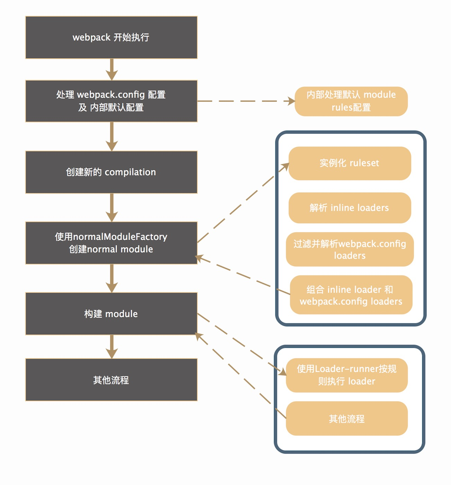

提纲：

1. loader 的配置(done)
2. loader 的匹配(done)
3. loader 的解析(参见 resolve 章节)
4. loader 的执行(TODO)
5. loader 的实践(TODO)

## Webpack loader 详解


### loader 的配置

Webpack 对于一个 module 所使用的 loader 对开发者提供了2种使用方式：

1. webpack config 配置形式，形如：

```javascript
// webpack.config.js
module.exports = {
  ...
  module: {
    rules: [{
      test: /.vue$/,
      loader: 'vue-loader'
    }, {
      test: /.scss$/,
      use: [
        'vue-style-loader',
        'css-loader',
        {
          loader: 'sass-loader',
          options: {
            data: '$color: red;'
          }
        }
      ]
    }]
  }
  ...
}
```

2. inline 内联形式

```javascript
// module

import a from 'raw-loader!../../utils.js'
```

2种不同的配置形式，在 webpack 内部有着不同的解析方式。此外，不同的配置方式也决定了最终在实际加载 module 过程中不同 loader 之间相互的执行顺序等。

### loader 的匹配

在讲 loader 的匹配过程之前，首先从整体上了解下 loader 在整个 webpack 的 workflow 过程中出现的时机。



可以看到在一个 module 构建过程中，首先根据 module 的依赖类型(例如 normalModuleFactory)调用对应的构造函数来创建对应的模块。在创建模块的过程中，会根据开发者的 webpack.config 当中的 rules 以及 webpack 内置的 rules 规则实例化 ruleset 匹配实例，这个 ruleset 实例在 loader 的匹配过滤过程中非常的关键，具体的源码解析可参见[Webpack Loader Ruleset 匹配规则解析](https://github.com/CommanderXL/Biu-blog/issues/30)。此外还会注册2个钩子函数:

```javascript
class NormalModuleFactory {
  ...
  // 内部嵌套 resolver 的钩子，完成相关的解析后，创建这个 module
  this.hooks.factory.tap('NormalModuleFactory', () => (result, callback) => { ... })

  // 在 hooks.factory 的钩子内部进行调用，实际的作用为解析构建一共 module 所需要的 loaders 及这个 module 的相关构建信息(例如获取 module 的 packge.json等)
  this.hooks.resolver.tap('NormalModuleFactory', () => (result, callback) => { ... })
  ...
}
```


...


接下来就调用 resolver 钩子(`hooks.resolver`)进入到了 resolve 的阶段，在真正开始 resolve loader 之前，首先就是需要匹配过滤找到构建这个 module 所需要使用的所有的 loaders。首先进行的是对于 inline loaders 的处理：

```javascript
// NormalModuleFactory.js

// 是否忽略 preLoader 以及 normalLoader
const noPreAutoLoaders = requestWithoutMatchResource.startsWith("-!");
// 是否忽略 normalLoader
const noAutoLoaders =
  noPreAutoLoaders || requestWithoutMatchResource.startsWith("!");
// 忽略所有的 preLoader / normalLoader / postLoader
const noPrePostAutoLoaders = requestWithoutMatchResource.startsWith("!!");

// 首先解析出所需要的 loader，这种 loader 为内联的 loader
let elements = requestWithoutMatchResource
  .replace(/^-?!+/, "")
  .replace(/!!+/g, "!")
  .split("!");
let resource = elements.pop(); // 获取资源的路径
elements = elements.map(identToLoaderRequest); // 获取每个loader及对应的options配置（将inline loader的写法变更为module.rule的写法）
```

首先是根据模块的路径规则，例如模块的路径是以这些符号开头的 `!` / `-!` / `!!` 来判断这个模块是否只是使用 inline loader，或者剔除掉 preLoader, postLoader 等规则：

* `!` 忽略 webpack.config 配置当中符合规则的 normalLoader
* `-!` 忽略 webpack.config 配置当中符合规则的 preLoader/normalLoader
* `!!` 忽略 webpack.config 配置当中符合规则的 postLoader/preLoader/normalLoader

这几个匹配规则主要适用于在 webpack.config 已经配置了对应模块使用的 loader，但是针对一些特殊的 module，你可能需要单独的定制化的 loader 去处理，而不是走常规的配置，因此可以使用这些规则来进行处理。

接下来将所有的 inline loader 转化为数组的形式，例如：

```javascript
import 'style-loader!css-loader!stylus-loader?a=b!../../common.styl'
```

最终 inline loader 统一格式输出为：

```javascript
[{
  loader: 'style-loader',
  options: undefined
}, {
  loader: 'css-lodaer',
  options: undefined
}, {
  loader: 'stylus-loader',
  options: '?a=b'
}]

```

对于 inline loader 的处理便是直接对其进行 resolve，获取对应 loader 的相关信息：

```javascript
asyncLib.parallel([
  callback => 
    this.resolveRequestArray(
      contextInfo,
      context,
      elements,
      loaderResolver,
      callback
    ),
  callback => {
    // 对这个 module 进行 resolve
    ...
    callack(null, {
      resouceResolveData, // 模块的基础信息，包含 descriptionFilePath / descriptionFileData 等(即 package.json 等信息)
      resource // 模块的绝对路径
    })
  }
], (err, results) => {
  const loaders = results[0] // 所有内联的 loaders
  const resourceResolveData = results[1].resourceResolveData; // 获取模块的基本信息
  resource = results[1].resource; // 模块的绝对路径
  ...
  
  // 接下来就要开始根据引入模块的路径开始匹配对应的 loaders
  let resourcePath =
    matchResource !== undefined ? matchResource : resource;
  let resourceQuery = "";
  const queryIndex = resourcePath.indexOf("?");
  if (queryIndex >= 0) {
    resourceQuery = resourcePath.substr(queryIndex);
    resourcePath = resourcePath.substr(0, queryIndex);
  }
  // 获取符合条件配置的 loader，具体的 ruleset 是如何匹配的请参见 ruleset 解析(https://github.com/CommanderXL/Biu-blog/issues/30)
  const result = this.ruleSet.exec({
    resource: resourcePath, // module 的绝对路径
    realResource:
      matchResource !== undefined
        ? resource.replace(/\?.*/, "")
        : resourcePath,
    resourceQuery, // module 路径上所带的 query 参数
    issuer: contextInfo.issuer, // 所解析的 module 的发布者
    compiler: contextInfo.compiler 
  });

  // result 为最终根据 module 的路径及相关匹配规则过滤后得到的 loaders，为 webpack.config 进行配置的
  // 输出的数据格式为：

  /* [{
    type: 'use',
    value: {
      loader: 'vue-style-loader',
      options: {}
    },
    enforce: undefined // 可选值还有 pre/post  分别为 pre-loader 和 post-loader
  }, {
    type: 'use',
    value: {
      loader: 'css-loader',
      options: {}
    },
    enforce: undefined
  }, {
    type: 'use',
    value: {
      loader: 'stylus-loader',
      options: {
        data: '$color red'
      }
    },
    enforce: undefined 
  }] */

  const settings = {};
  const useLoadersPost = []; // post loader
  const useLoaders = []; // normal loader
  const useLoadersPre = []; // pre loader
  for (const r of result) {
    if (r.type === "use") {
      // postLoader
      if (r.enforce === "post" && !noPrePostAutoLoaders) {
        useLoadersPost.push(r.value);
      } else if (
        r.enforce === "pre" &&
        !noPreAutoLoaders &&
        !noPrePostAutoLoaders
      ) {
        // preLoader
        useLoadersPre.push(r.value);
      } else if (
        !r.enforce &&
        !noAutoLoaders &&
        !noPrePostAutoLoaders
      ) {
        // normal loader
        useLoaders.push(r.value);
      }
    } else if (
      typeof r.value === "object" &&
      r.value !== null &&
      typeof settings[r.type] === "object" &&
      settings[r.type] !== null
    ) {
      settings[r.type] = cachedMerge(settings[r.type], r.value);
    } else {
      settings[r.type] = r.value;
    }

    // 当获取到 webpack.config 当中配置的 loader 后，再根据 loader 的类型进行分组(enforce 配置类型)
    // postLoader 存储到 useLoaders 内部
    // preLoader 存储到 usePreLoaders 内部
    // normalLoader 存储到 useLoaders 内部
    // 这些分组最终会决定加载一个 module 时不同 loader 之间的调用顺序

    // 当分组过程进行完之后，即开始 loader 模块的 resolve 过程
    asyncLib.parallel([
      [
        // resolve postLoader
        this.resolveRequestArray.bind(
          this,
          contextInfo,
          this.context,
          useLoadersPost,
          loaderResolver
        ),
        // resove normal loaders
        this.resolveRequestArray.bind(
          this,
          contextInfo,
          this.context,
          useLoaders,
          loaderResolver
        ),
        // resolve preLoader
        this.resolveRequestArray.bind(
          this,
          contextInfo,
          this.context,
          useLoadersPre,
          loaderResolver
        )
      ],
      (err, results) => {
        ...
        // results[0]  ->  postLoader
        // results[1]  ->  normalLoader
        // results[2]  ->  preLoader
        // 这里将构建 module 需要的所有类型的 loaders 按照一定顺序组合起来，对应于：
        // [postLoader, inlineLoader, normalLoader, preLoader]
        // 最终 loader 所执行的顺序对应为： preLoader -> normalLoader -> inlineLoader -> postLoader
        // 不同类型 loader 上的 pitch 方法执行的顺序为： postLoader.pitch -> inlineLoader.pitch -> normalLoader.pitch -> preLoader.pitch (具体loader内部执行的机制后文会单独讲解)
        loaders = results[0].concat(loaders, results[1], results[2]);

        process.nextTick(() => {
          ...
          // 执行回调，创建 module
        })
      }
    ])
  }
})
```

简单总结下这个流程就是：

...