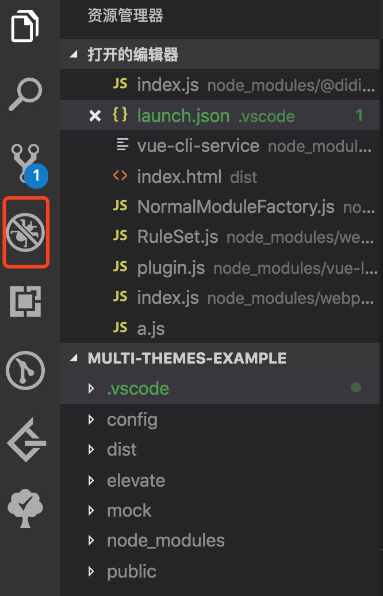
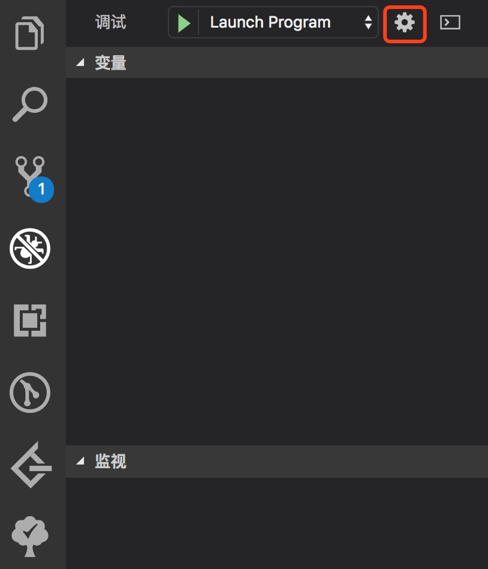
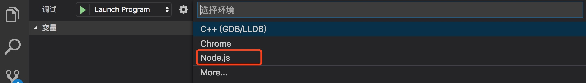

## Webpack debugger

工欲善其事必先利其器，在你开始了解 webpack 源码以前，首先需要了解下如果对 webpack 源码进行调试。因为笔者日常使用的是 VScode 作为我的编辑器，所以在这里我也是介绍下通过 VScode 来进行 webpack 的源码，或者是对 webpack 相关的 loader、plugin 进行调试。

我们的调试都是在 node 环境下进行的，不涉及到 browser，而 VScode 内部已经集成了 node debugger 环境，因此我们不需要安装其他的插件，直接进入到 debugger 配置阶段。

1. 打开 Activity Bar 上的 Debugger View 面板，初始化一个 lanuch.json 文件







VScode 会帮你在项目的根目录下初始化一个 .vscode/launch.json 文件。接下来就进行 debugger 相关的配置。

2. 写配置

name: 这个 debugger 任务名
program: 程序的绝对路径，当 debugger 启动时所执行的文件。
args: 传递给程序的命令行参数。

例如在我的一个 vue 项目当中，webpack 被 vue-cli-service 封装到里面了，项目相关的一些构建的命令都需要通过 vue-cli-service 提供的 node bash (具体可参见通过 vue-cli 生成的项目中 package.json 配置的 npm script)进行启动。因此我需要进行的 lanuch.json 的配置就是：

```javascript
{
  // 使用 IntelliSense 了解相关属性。
  // 悬停以查看现有属性的描述。
  // 欲了解更多信息，请访问: https://go.microsoft.com/fwlink/?linkid=830387
  "version": "0.2.0",
  "configurations": [
    {
      "type": "node",
      "request": "launch",
      "name": "vue-cli-service debug",
      "program": "${workspaceFolder}/node_modules/.bin/vue-cli-service",
      "args": ["build"]
    }
  ]
}
```

3. 启动

这些配置好了之后即可按 F5 开始进行 debugger 了。

具体有关 VScode debugger 的一些使用方法和技巧，可查阅相关文档：

* [Debugger](https://code.visualstudio.com/docs/editor/debugging)