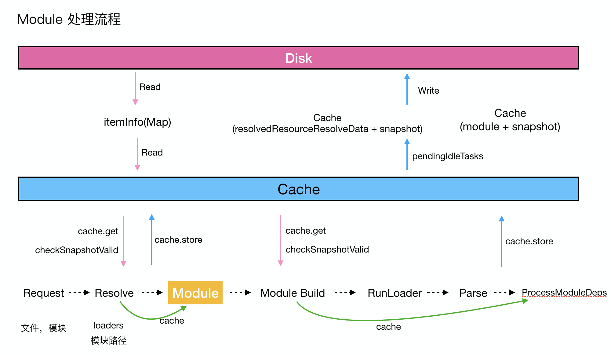
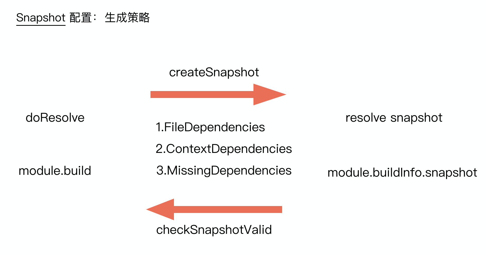

## 基本介绍

持久化缓存是 webpack5 所带来的非常强大的特性之一。一句话概括就是构建结果持久化缓存到本地的磁盘，二次构建(非 watch 模块)直接利用磁盘缓存的结果从而跳过构建过程当中的 resolve、build 等耗时的流程，从而大大提升编译构建的效率。

持久化缓存主要解决的就是优化编译流程，减少编译耗时的问题，通过全新的缓存系统的设计使得整个构建流程更加的高效和安全。在此之前官方或者社区也有不少解决编译耗时，提高编译效率的方案。

例如官方提供的 [`cache-loader`](https://github.com/webpack-contrib/cache-loader)，可将上一个 loader 处理的结果缓存到磁盘上，下一次在走这个流程的时候(pitch)依据一定的规则来使用缓存内容从而跳过后面 loader 的处理。不过 `cache-loader` 也仅仅能覆盖到经由 `loader` 处理后的文件内容，缓存内容的范围比较受限，此外就是 `cache-loader` 缓存是在构建流程当中进行的，缓存数据的过程也是有一些性能开销的，会影响整个的编译构建速度，所以建议是搭配译耗时较长的 loader 一起使用。另外就是 `cache-loader` 是通过对比文件 metadata 的 timestamps，这种缓存失效策略不是非常的安全，具体见[我之前遇到的case](https://github.com/CommanderXL/Biu-blog/issues/48)。

此外还有 `babel-loader`、`eslint-loader` 内置的缓存功能，`DLL` 等。核心的目的就是已经处理过的内容不需要再重新走一遍原有的流程。这些方案都能解决一定场景下的编译效率问题。

## 基本使用

持久化缓存是开箱即用的一个功能，但是默认不开启。为什么 webpack 没有将这个功能默认开启呢？这个其实也在[持久化文档](https://github.com/webpack/changelog-v5/blob/master/guides/persistent-caching.md#opt-in)中有做说明：webpack 将(反)序列化数据的流程内置并做到的开箱即用，但是对于项目的使用者而言是需要充分了解持久化缓存的一些基本配置和策略，来确保在实际开发环节编译构建的安全性(缓存失效策略)。

先看下基本的配置规则 [`cache`](https://webpack.js.org/configuration/cache/#cache) 使用：

```javascript
// webpack.config.js
module.exports = {
  cache: {
    // 开启持久化缓存
    type: 'fileSystem',
    buildDependencies: {
      config: [__filename]
    }
  }
}
```

在 `cache` 字段下完成有关持久化缓存的基本配置，当 type 为 fileSystem 时开启持久化缓存的能力(watch 模式下是分级缓存配合使用)，另外需要特别注意的是 `buildDependencies` 的配置，这个配置和整个构建流程的安全性有关。常见于和项目相关的一些配置信息，例如你是使用 `@vue/cli` 进行开发的项目，那么 `vue.config.js` 就需要作为项目的 `buildDependencies`，此外 webpack 在内部处理流程当中将所有的 loader 也作为了 `buildDependenceis`，一旦 `buildDependencies` 发生了变更，那么在编译流程的启动阶段便会导致整个缓存失效，进而走一遍新的构建流程。

此外，和持久化缓存另外一个相关的配置是：[`snapshot`](https://webpack.js.org/configuration/other-options/#snapshot)。`snapshot` 相关的配置决定了缓存内存生成 `snapshot` 时所采用的策略(`timestamps` | `content hash` | `timestamps + content hash`)，而这个策略最终会影响到缓存是否失效，即 webpack 是否决定来使用缓存。

```javascript
const path = require('path')
module.exports = {
  // ...
  snapshot: {
    // 针对包管理器维护存放的路径，如果相关依赖命中了这些路径，那么他们在创建 snapshot 的过程当中不会将 timestamps、content hash 作为 snapshot 的创建方法，而是 package 的 name + version
    // 一般为了性能方面的考虑，
    managedPaths: [path.resolve(__dirname, '../node_modules')],
    immutablePaths: [],
    // 对于 buildDependencies snapshot 的创建方式
    buildDependencies: {
      // hash: true
      timestamp: true
    },
    // 针对 module build 创建 snapshot 的方式
    module: {
      // hash: true
      timestamp: true
    },
    // 在 resolve request 的时候创建 snapshot 的方式
    resolve: {
      // hash: true
      timestamp: true
    },
    // 在 resolve buildDependencies 的时候创建 snapshot 的方式
    resolveBuildDependencies: {
      // hash: true
      timestamp: true
    }
  }
}
```

不同的创建 snapshot 方式**有不同的性能表现、安全性考虑和适用场景**，具体可以参阅[相关的文档](https://github.com/webpack/changelog-v5/blob/master/guides/persistent-caching.md#snapshot-types)。

其中需要注意一点 `cache.buildDependencies` 和 `snapshot.buildDependencies` 的含义并不一致。`cache.buildDependencies` 是将哪些文件 or 目录作为 `buildDependencies`(webpack 内部会默认将所有的 `loader` 作为 `buildDependencies`) 而 `snapshot.buildDependencies` 是定义这些 `buildDependencies` 创建 `snapshot` 的方式(`hash/timestamp`)。

构建产出缓存在 webpack 内部已经完成了，但是对于一个应用项目而言，高频的业务开发迭代节奏，基础库的升级、第三方库的接入等等，对于这部分的更新而言 webpack 显然需要做的一件事情就是感知其变更，同时使缓存失效而重新构建新的模块，构建结束后重新写入缓存，这也是 webpack 在持久化缓存设计当中非常重要的一个特性：安全性。

## 工作流 & 原理介绍

首先我们来看下一个 `module` 的处理流程，一般会经过：

* `resolve`（路径查找，需要被处理的文件路径，loader 路径等）
* `build`（构建）
* `generate`（代码生成）

等阶段。

`module` 被创建之前，需要经过一系列的 resolve 过程，例如需要被处理的文件路径，loader 等等。

`module` 被创建之后，需要经过 build 的过程：基本上就是交由 loader 处理后进行 parse，这个过程结束后开始处理依赖。

特别是针对 `resolve`、`build` 阶段都有一些优化的建议或者是相关的插件来提升其效率。例如在 `resolve` 阶段可以通过 `resolve.extensions` 减少 resolve 阶段匹配路径的后缀类型。其核心的目的还是为了减少 `resolve` 的流程来提高效率。在 `build` 阶段，针对一些耗时的操作使用 `cache-loader` 缓存对应的处理结果等等。

那么在持久化缓存的方案当中，针对这些场景又是如何来进行设计和处理的呢？

首先来看下和 `resolve` 相关的持久化缓存插件：`ResolverCachePlugin.js`

```javascript
class CacheEntry {
  constructor(result, snapshot) {
    this.result = result
    this.snapshot = snapshot
  }
  // 部署(反)序列化接口
  serialize({ write }) {
    write(this.result)
    write(this.snapshot)
  }
  deserialize({ read }) {
    this.result = read()
    this.snapshot = read()
  }
}

// 注册(反)序列化数据结构
makeSerializable(CacheEntry, 'webpack/lib/cache/ResolverCachePlugin')

class ResolverCachePlugin {
  apply(compiler) {
    const cache = compiler.getCache('ResolverCachePlugin')
    let fileSystemInfo
    let snapshotOptions
    ...
    compiler.hooks.thisCompilation.tap('ResolverCachePlugin', compilation => {
      // 创建 resolve snapshot 相关的配置
      snapshotOptions = compilation.options.snapshot.resolve
      fileSystemInfo = compilation.fileSystemInfo
      ...
    })

    const doRealResolve = (
      itemCache,
      resolver,
      resolveContext,
      request,
      callback
    ) => {
      ...
      resolver.doResolve(
        resolver.hooks.resolve,
        newRequest,
        'Cache miss',
        newResolveContext,
        (err, result) => {
          const fileDependencies = newResolveContext.fileDependencies
          const contextDependencies = newResolveContext.contextDependencies
          const missingDependencies = newResolveContext.missingDependencies
          // 创建快照
          fileSystemInfo.createSnapshot(
            resolveTime,
            fileDependencies,
            contextDependencies,
            missingDependencies,
            snapshotOptions,
            (err, snapshot) => {
              ...
              // 持久化缓存
              itemCache.store(new CacheEntry(result, snapshot), storeErr => {
                ...
                callback()
              })
            }
          )
        }
      )
    }

    compiler.resolverFactory.hooks.resolver.intercept({
      factory(type, hook) {
        hook.tap('ResolverCachePlugin', (resolver, options, userOptions) => {
          ...
          resolver.hooks.resolve.tapAsync({
            name: 'ResolverCachePlugin',
            stage: -100
          }, (request, resolveContext, callback) => {
            ...
            const itemCache = cache.getItemCache(identifier, null)
            ...
            const processCacheResult = (err, cacheEntry) => {
              if (cacheEntry) {
                const { snapshot, result } = cacheEntry
                // 判断快照是否失效
                fileSystemInfo.checkSnapshotValid(
                  snapshot,
                  (err, valid) => {
                    if (err || !valid) {
                      // 进入后续的 resolve 环节
                      return doRealResolve(
                        itemCache,
                        resolver,
                        resolveContext,
                        request,
                        done
                      )
                    }
                    ...
                    // 使用缓存数据
                    done(null, result)
                  }
                )
              }
            }
            // 获取缓存
            itemCache.get(processCacheResult)
          })
        })
      }
    })
  }
}
```

webpack 在做 resolve 缓存的流程是非常清晰的：通过在 `resolverFactory.hooks.resolver` 上做了劫持，并添加 `resolver.hooks.resolve` 的钩子，需要注意的是这个 resolve hook 的执行时机 `stage: -100`，这也意味着这个 hook 执行时机是非常靠前的。

通过 identifier 唯一标识去获取持久化缓存的内容：resolveData 和 snapshot，接下来判断 snapshot 是否失效，如果失效的话就重新走 resolve 的逻辑，如果没有失效直接返回 resolveData，跳过 resolve 流程。而在实际走 resolve 的过程当中，流程结束后，首先需要做的一个工作就是依据 `fileDependencies`、`contextDependencies`、`missingDependencies` 以及在 webpack.config 里面 snapshot 的 resolve 配置来生成快照的内容，到这里 resolve 的结果以及 snapshot 都已经生成好了，接下来调用持久化缓存的接口 `itemCache.store` 将这个缓存动作放到缓存队列当中。

接下来看下 module build 当中和持久化缓存相关的内容。

在一个 module 在创建完后，需要将这个 module 加入到整个 moduleGraph 当中来，首先通过 `_modulesCache.get(identifier)` 来获取这个 module 的缓存数据，如果有缓存数据那么使用缓存数据，没有的话就使用本次创建 module 当中使用的数据。

```javascript
class Compilation {
  ...
  handleModuleCreation(
    {
      factory,
      dependencies,
      originModule,
      contextInfo,
      context,
      recusive = true,
      connectOrigin = recursive
    },
    callback
  ) {
    // 创建 module
    this.factorizeModule({}, (err, factoryResult) => {
      ...
      const newModule = factoryResult.module

      this.addModule(newModule, (err, module) => {
        ...
      })
    })
  }

  _addModule(module, callback) {
    const identifer = module.identifier()
    // 获取缓存模块
    this._modulesCache.get(identifier, null, (err, cacheModule) => {
      ...
      this._modules.set(identifier, module)
      this.modules.add(module)
      ...
      callback(null, module)
    })
  }
}
```

接下来进入到 buildModule 阶段，在实际进入后续 build 流程之前，有个比较重要的工作就是通过 `module.build` 方法判断当前 module 是否需要重新走 build 流程，这里面也有几层不同的判断逻辑，例如 loader 处理过程中指定 `buildInfo.cachable`，又或者说当前模块没有 snapshot 去检查也是需要重新走 build 流程的，最后就是在 snapshot 存在的情况下，需要检查 snapshot 是否失效。一旦判断这个 module 的 snapshot 没有失效，即走缓存的逻辑，那么最终会跳过这个 module 被 loader 处理以及被 parse 的环节。因为这个 module 的所有进行都是从缓存当中获取，包括这个 module 的所有依赖，接下来就进入递归处理依赖的阶段。如果 snapshot 失效了，那么就走正常的 build 流程(loader 处理，parse，收集依赖等)，build 流程结束后，会利用在构建过程中收集到的 `fileDependencies`、`contextDependencies`、`missingDependencies` 以及在 webpack.config 里面 snapshot 的 module 配置来生成快照的内容，此时当前 module 编译流程结束，同时快照也已经生成好了，接下来才会调用持久化缓存接口 `this._modulesCache.store(module.identifier(), null, module)` 将这个缓存动作放到缓存队列当中。

```javascript
// compilation.js
class Compilation {
  ...
  _buildModule(module, callback) {
    ...
    // 判断 module 是否需要被 build
    module.needBuild(..., (err, needBuild) => {
        ...
        if (!needBuild) {
          this.hooks.stillValidModule.call(module)
          return callback()
        }

        ...
        // 实际 build 环节
        module.build(..., err => {
          ...
          // 将当前 module 内容加入到缓存队列当中
          this._modulesCache.store(module.identifier(), null, module, err => {
            ...
            this.hooks.succeedModule.call(module)
            return callback()
          })
        })
      }
    )
  }
}

// NormalModule.js
class NormalModule extends Module {
  ...
  needBuild(context, callback) {
    if (this._forceBuild) return callback(null, true)

    // always build when module is not cacheable
    if (!this.buildInfo.cachable) return callback(null, true)

    // build when there is no snapshot to check
    if (!this.buildInfo.snapshot) return callback(nuull, true)
    ...

    // check snapshot for validity
    fileSystemInfo.checkSnapshotValid(this.buildInfo.snapshot, (err, valid) => {
      if (err) return callback(err);
      if (!valid) return callback(null, true);
        const hooks = NormalModule.getCompilationHooks(compilation);
        hooks.needBuild.callAsync(this, context, (err, needBuild) => {
        if (err) {
          return callback(
            HookWebpackError.makeWebpackError(
            err,
            "NormalModule.getCompilationHooks().needBuild"
          )
        );
      }
      callback(null, !!needBuild);
      });
    });
  }
}
```

一张图来梳理下上述的流程：




通过分析 module 被创建之前的 resolve 流程以及创建之后的 build 流程，基本了解了在整个缓存系统当中上层使用的流程，一个比较重要的点就是缓存的安全性设计，**即在做持久化缓存的过程中，需要被缓存的内容是一方面，有关这个缓存的 snapshot 也是需要被缓存下来的，这个是缓存是否失效的判断依据**。

watch 阶段对比 snapshot：文件的变化触发新的一次 compilation，在 `module.needBuild` 中根据 snapshot 来判断是否需要重新走编译的流程，这个时候内存当中的 `_snapshotCache` 虽然存在，但是以 Object 作为 key 的 Map 获取 `module.buildInfo.snapshot` 阶段的时候为 `undefined`，因此还是会进行 `_checkSnapshotValidNoCache`，实际上 `snapshot` 信息一方面被持久化缓存到磁盘当中，此外在生成 snapshot 的阶段时，内存当中也缓存了不同 module 的 timestamp、content hash 这些信息，所以在 `_checkSnapshotValidNoCache` 执行的阶段也是优先从缓存当中获取这些信息并进行对比。

第二次热启动对比 snapshot ：内存当中的 `_snapshotCache` 已经不存在，首先从缓存当中读取 `module.buildInfo.snapshot` 快照的内容，然后进行 `_checkSnapshotValidNoCache`

那么对于 snapshot 来说，有哪些内容是需要被关注的呢？

首先第一点就是和当前需要被缓存内容强相关的路径依赖，包含了：`fileDependencies`、`contextDependencies`、`missingDependencies`，在生成 snapshot 的过程当中，这些路径依赖是需要被包含在内的，同时也是判断缓存是否失效的依据；




第二点就是在 snapshot 相关的配置策略，这也决定了 snapshot 的生成方式（timestampes、content hash）、速度以及可靠性。

timestamps 成本低，但是容易失效，content hash 成本更高，但是更加安全。
本地开发的情况下，涉及到频繁的变动，所以使用成本更低的 timestamps 校验的方式。但是对于 buildDependencies，相对来说一遍是供编译环节消费使用的配置文件等，对于单次的构建流程来说其变动的频率比较小，同时一般这些配置文件会影响到大量的模块的编译，所以使用 content hash。

在 CI 场景下，例如如果是 git clone 的操作的话（缓存文件的存放），一般是 timestamps 会变，但是为了加速编译速度，使用 content hash 来作为 snapshot 的校验规则。另外一种场景是 git pull 操作，部分内容的 timestamps 不会经常变，那么使用 timestamps + content hash 的策略规则。

这部分有关 snapshot 具体的生成策略可以参照 [`FileSystemInfo.js`](https://github.com/webpack/webpack/blob/main/lib/FileSystemInfo.js#L1886) 里面有关 `createSnapshot` 方法的实现。

另外一个需要关注的点就是 `buildDependencies` 对于缓存安全性的影响，在构建启动之后 webpack 首先会读取缓存，但是在决定是否使用缓存之前有个非常重要的判断依据就是对于 `buildDependencies` 的 `resolveDependencies`、`buildDependencies` snapshot 进行检查，只有当两者的 snapshot 和缓存对比没有失效的情况下才可启用缓存数据，否则缓存数据会全量失效。其效果等同于项目进行一次全新的编译构建流程。

此外还想说下就是整个持久化缓存的底层设计：持久化缓存的流程设计是非常独立且和项目应用的 compile 流程完全解耦的。

在这其中有一个非常重要的类 `Cache`，衔接了整个项目应用的 compile 流程以及持久化缓存的流程。

```javascript
// lib/Cache.js
class Cache {
  constructor() {
    this.hooks = {
      get: new AsyncSeriasBailHook(['identifer', 'etag', 'gotHandlers']),
      store: new AsyncParallelHook(['identifer', 'etag', 'data']),
      storeBuildDependenceies: new AsyncParallelHook(['dependencies']),
      beginIdle: new SyncHook([]),
      endIdle: new AsyncParallelHook([]),
      shutdown: new AsyncParallelHook([])
    }
  },
  get(identifier, etag, callback) {
    this.hooks.get.callAsync(identifer, etag, gotHandler, (err, result) => {
      ...
    })
  },
  store(identifer, etag, data, callbackk) {
    this.hooks.store.callAsync(identifer, etag, data, makeWebpackErrorCallback(callback, 'Cache.hooks.store'))
  }
}
```

compile 流程当中需要进行缓存的读取或者写入操作的时候调用 `Cache` 实例上暴露的 `get`、`store` 方法，然后 `Cache` 通过自身暴露出来的 `hooks.get`、`hooks.store` 来和缓存系统进行交互。之前有提到过在使用持久化缓存的过程中 webpack 内部其实是启动了分级缓存，即：内存缓存(`MemoryCachePlugin.js`、`MemoryWithGcCachePlugin.js`)和文件缓存(`IdleFileCachePlugin.js`)。

内存缓存和文件缓存分别注册 `Cache` 上暴露出来的 `hooks.get`、`hooks.store`，这样当在 compile 过程当中抛出 `get`/`store` 事件时也就和缓存的流程衔接上了。

在 `get` 的阶段， watch 模式下的持续构建环节，优先使用内存缓存（一个 Map 数据）。在二次构建，没有内存缓存的情况下，使用文件缓存。

在 `store` 的阶段，并非是立即将缓存内容写入磁盘，而是将所有的写操作缓存到一个队列里面，当 compile 阶段结束后，才进行写的操作。

对于需要被持久化缓存的数据结构来说：

1. 按约定单独部署(反)序列化数据的接口(`serialize`、`deserialize`)
2. 注册序列化数据结构([`makeSerializable`](https://github.com/webpack/webpack/blob/main/lib/util/makeSerializable.js))

在 compile 结束后进入到(反)序列化缓存数据的阶段，实际上也是对应调用数据结构上部署的 `(de)serialize` 接口晋升(反)序列化数据。

整体看下来 webpack5 提供的持久化缓存的技术方案相对于开篇提到的一些构建编译提效的方案来说更加完备，可靠，性能更优，主要体现在：

* 开箱即用，简单的配置即可开启持久化特性；
* 完备性：v5 设计的一套缓存体系更加细粒度覆盖到了 compile 流程当中非常耗时的流程，例如不仅仅是上文提到的 module resolve、build 阶段，还在 代码生成、sourceMap 阶段都使用到了持久化缓存。此外对于开发者而言，遵照整个缓存体系的约定也可以开发出基于持久化缓存特性的功能特性，从而提高编译效率；
* 可靠性：相较于 v4 版本，内置了更加安全基于 content hash 的缓存对比策略，即 timestamp + content hash，不同的开发环境、场景下在开发效率和安全性之间取得平衡；
* 性能：compile 流程和持久化缓存解耦，在 compile 阶段持久化缓存数据的动作不会阻碍整个流程，而是缓存至一个队列当中，只有当 compile 结束后才会进行，与之相关的配置可参见 `cache`


## 对开发者而言

* 基于持久化缓存特性开发的 custom module、dependency 需按照约定部署相关接口；
* 依托框架提供的缓存策略，构建安全可靠的依赖关系、缓存；

## 对使用者而言

* 需要了解持久化缓存所解决的问题；
* 不同开发环境(dev、build)、场景(CI/CD)下的缓存、snapshot 等相关的生成策略、配置，适用性；
* 缓存失效的策略规则；

相关文档：

* [官方文档](https://webpack.js.org/configuration/cache/)
* [webpack5 release](https://webpack.js.org/blog/2020-10-10-webpack-5-release/)
* [changelog-v5](https://github.com/webpack/changelog-v5/blob/master/guides/persistent-caching.md)