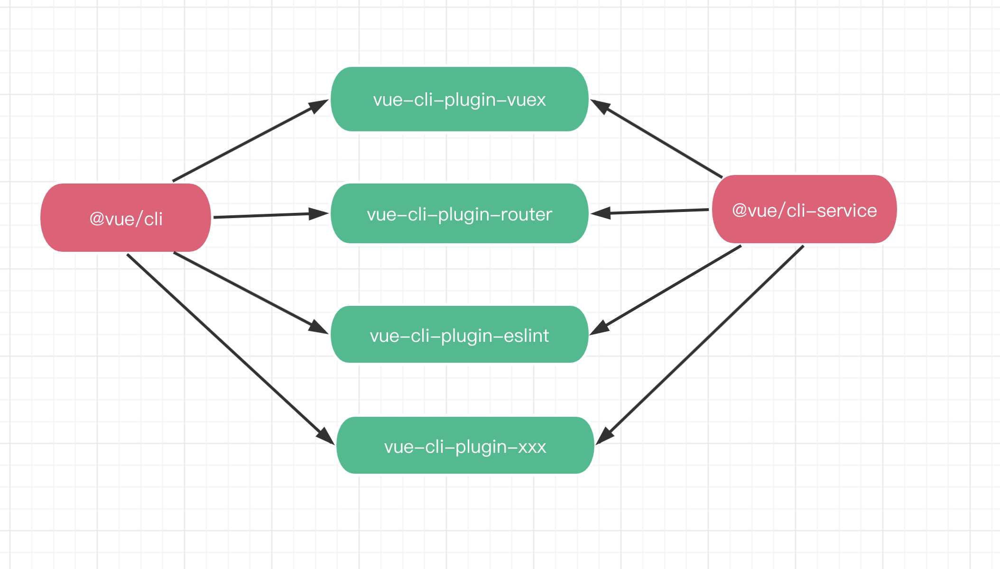

# mpx-cli@next 插件化改造

## 背景 & 现状

`@mpxjs/cli@2.x` 版本整体是基于模板配置的方式完成项目的初始化，整个的工作流是：

1. 下载一份存放于远端的 mpx 项目原始模板（mpx-template）

2. 根据用户的 prompts 选项完成用户选项的注入，并初始化最终的项目文件

完成项目的初始化后，除了一些基础配置文件外，整个项目的文件主要包含了如下的结构：

```javascript
-- mpx-project
 |-- src // 项目源码
 |-- config // 项目配置文件
   |-- dll.config.js // dll 配置
   |-- index.js // 配置入口文件
   |-- mpxLoader.conf.js // mpx-loader 配置
   |-- mpxPlugin.conf.js // mpx webpack-plugin 配置
   |-- user.conf.js // 用户的 prompts 选择信息
 |-- build // 编译构建配置
   |-- build.js // 构建编译脚本
   |-- getPlugins.js // webpack plugins 
   |-- getRules.js // webpack module rules
   |-- getWebpackConf.js // webpack 配置生成辅助函数
   |-- utils.js // 工具函数
   |-- webpack.base.conf.js // webpack 基础配置
```

在初始化的项目当中，有关项目的所有配置文件，编译构建代码是全部暴露给开发者的，开发者可以对这些文件进行修改来满足自己实际的项目开发需要。同时还可以基于这一套原始的模板文件二次拓展为满足自己业务场景的模板。

基于远程模板初始化项目的方式最大的一个好处就是将项目所有的底层配置完全暴露给开发者，开发者可以任意去修改对应的配置。

但是目前 `@mpxjs/cli@2.x` 采用这种基于模板的方式面临着这样的一些问题：

1. 对于 `@mpxjs/cli` 的用户而言：

*  如果远程模板的维护者如果对远程模板(mpx-template)进行了更新，对于用户来说没有一个很好的方式完成升级工作，基本只能通过 copy 代码的方式，将 `mpx-template` 更新后的内容复制一份到自己的项目当中；

* `@mpxjs/cli` 提供的是大而全的能力，从项目结构角度来说没法做到按需。例如我需要开发一个小程序，但是像 `dll` 这种增强的功能或者是没有使用到的小程序插件的构建配置都会出现在生成项目当中(虽然通过一些配置在构建过程中关闭了这些功能)。那么用户在进行编译打包构建配置的时候需要花些时间去理解整个配置的生成过程，来决定到底需要在哪里进行改造。


2. 对于 `@mpxjs/cli` 的开发者而言：

* 分支场景多，功能模块耦合度高：脚手架的所有功能全部集合到一个大的模板当中。各部分的能力都是耦合在一起，为了满足不同项目的实际开发需要，代码里面需要写比较多的 `if...else...` 判断逻辑来决定要开启哪些功能。


## 解决方案

`vue` 在2年前发布了 `@vue/cli@3.x`，和 `2.x` 版本相比而言，整个 `@vue/cli` 的架构发生了非常大的变化，从基于模板的脚手架迭代为基于插件化的脚手架。简单的概述下整个插件化的构架就是：



* @vue/cli 提供 vue cli 命令，负责偏好设置，生成模板、`vue-cli-plugin` 插件依赖管理的工作，例如 `vue create <projectName>`、`vue add <pluginName>`；

* @vue/cli-service 作为 @vue/cli 整个插件系统当中的内部核心插件，提供了 npm script 注册服务，内置了部分 webpack 配置的同时，又提供了 `vue-cli-plugin` 插件的导入、加载以及 webpack 配置更新服务等。

以上是 `@vue/cli` 生态当中最为核心的两部分内容，二者分工明确，各司其职。

此外在 `@vue/cli` 生态当中非常重要的一个点就是 `vue-cli-plugin` 插件。根据 `@vue/cli` 设计的规范，开发一个 `vue-cli-plugin` 需要遵照相关的约定来进行开发：

* @vue/cli 约定插件如果要生成模板，那么需要提供 `generator` 入口文件；

* @vue/cli-service 约定插件的 `webpack` 配置更新需要放到插件的入口文件当中来完成，同时插件的命名也需要包含 `vue-cli-plugin` 前缀，因为 @vue/cli-service 是依据命名来加载相关的插件的；

再回过头来看 `@mpxjs/cli@2.x` 版本所遇到的几个痛点在 `@vue/cli@3.x` 新的架构模式下都得到了很好的解决：

1. 将大而全的模板根据功能职责拆分到每个 `vue-cli-plugin` 当中，由插件内部去收敛模板的生成，以及编译打包构建配置；

2. 每个插件都是以 npm package 的形式管理并发布的，因此是带有版本控制的(而之前的 `mpx-template` 是不具备这种快速更新的能力的，只能通过 copy 代码的方式)，所以每个插件可单独升级更新，对于用户侧而言如果需要升级，安装插件对应的新版本即可；

3. 用户初始化项目过程中选择完开发场景后，脚手架会按需安装对应开发所需要的插件。不需要的功能插件一律不安装，同时日后如果需要这部分的功能，通过 `mpx add vue-cli-plugin-xxx` 方式即可完成插件的安装与使用；

## 改造细节

### 模块拆分

从跨平台的角度出发：

1. web 开发

2. 小程序开发

* 基于 `wx` 的跨平台(`ali`、`swan`，`tt`)的小程序开发；
* 使用云函数的微信小程序开发；
* 微信小程序的插件模式的开发；

一个项目可能只需要某一种开发模式，例如仅仅是微信小程序的插件模式开发，也有可能是小程序和web平台混合开发等等，不同的开发模式对应了：

1. **不同的目录结构**；

2. **不同的编译构建配置**

---

基于这样一种现状以及 `@mpxjs/cli` 所要解决的问题，从跨平台的角度出发将功能进行了拆分，最终拆解为如下的9个插件：

* [vue-cli-plugin-mpx](https://github.com/mpx-ecology/mpx-cli/tree/master/packages/vue-cli-plugin-mpx)（mpx 基础开发插件）

* [vue-cli-plugin-mpx-mp](https://github.com/mpx-ecology/mpx-cli/tree/master/packages/vue-cli-plugin-mpx-mp)（mpx 小程序平台开发插件）

* [vue-cli-plugin-mpx-web](https://github.com/mpx-ecology/mpx-cli/tree/master/packages/vue-cli-plugin-mpx-web)（mpx 跨 web 平台开发插件）

* [vue-cli-plugin-mpx-cloud-func](https://github.com/mpx-ecology/mpx-cli/tree/master/packages/vue-cli-plugin-mpx-cloud-func)（微信小程序云函数开发插件）

* [vue-cli-plugin-mpx-plugin-mode](https://github.com/mpx-ecology/mpx-cli/tree/master/packages/vue-cli-plugin-mpx-plugin-mode)（微信小程序插件模式开发插件）

* [vue-cli-plugin-mpx-eslint](https://github.com/mpx-ecology/mpx-cli/tree/master/packages/vue-cli-plugin-mpx-eslint)（mpx eslint 插件）

* [vue-cli-plugin-mpx-unit-test](https://github.com/mpx-ecology/mpx-cli/tree/master/packages/vue-cli-plugin-mpx-unit-test)（小程序单元测试插件）

* [vue-cli-plugin-mpx-typescript](https://github.com/mpx-ecology/mpx-cli/tree/master/packages/vue-cli-plugin-mpx-typescript)（mpx typescript 插件）

* [vue-cli-plugin-mpx-dll](https://github.com/mpx-ecology/mpx-cli/tree/master/packages/vue-cli-plugin-mpx-dll)（Webpack Dll 插件）

这些拆解出来的插件都将和功能相关的**项目模板**以及**编译构建**配置进行了收敛。

项目模板的生成不用说，借助 `@vue/cli` 的 `Generator API` 按需去生成项目开发所需要的模板，例如项目需要使用 `eslint` 的功能，那么在生成项目的时候会生成对应 `vue-cli-plugin-mpx-eslint` 所提供的模板文件，如果不需要使用，项目当中最终也不会出现和 `eslint` 相关的文件配置。

重点说下编译构建的配置是如何进行拆解的：

**在 `@vue/cli@3.x` 基于插件的架构设计当中，决定是否要使用某个插件的依据就是判断这个插件是否被你的项目所安装**和基于模板的构架相比最大的区别就是：基于模板的架构在最终生成的模板配置里需要保存一些环境配置文件，以供编译构建的运行时来判断是否启用某些功能。但是基于插件的架构基本上是不再需要这些环境配置文件的，因为你如果要使用一个插件的功能，只需要安装它即可。

因此依照这样的设计规范，我们将：

* `eslint`

* `unit-test`

* `typescript`

* `dll` 

这些非常独立的功能都单独抽离成了可拔插的插件，安装即启用。

以上功能有个特点就是和平台是完全解耦的，所以在拆解的过程中可以拆的比较彻底。但是由于 `mpx` 项目的特殊性，即要支持基于 `wx` 小程序的跨端以及 `web` 开发，同时还要支持小程序的云函数、小程序插件模式的开发，且不同开发模式的编译构建配置都有些差异。可以用如下的集合图来表示他们之间的关系：


在不同平台开发模式下是有 `mpx` 编译构建的基础配置的，这个是和平台没有太多关系，因此将这部分的配置单独抽离为一个插件：`vue-cli-plugin-mpx`，**同时这个插件也被置为了 `@mpxjs/cli` 的 `preset` 预设插件，不管任何项目开发模式下，这个插件都会被默认的安装**。

```javascript
// vue-cli-plugin-mpx
module.exports = function (api, options, webpackConfig) {
  webpackConfig.module
    .rule('json')
    .test(/\.json$/)
    .resourceQuery(/__component/)
    .type('javascript/auto')

  webpackConfig.module
    .rule('wxs-pre-loader')
    .test(/\.(wxs|qs|sjs|filter\.js)$/)
    .pre()
    .use('mpx-wxs-pre-loader')
    .loader(MpxWebpackPlugin.wxsPreLoader().loader)

  webpackConfig.module.rules.delete('images')
  const mpxUrlLoader = MpxWebpackPlugin.urlLoader({
    name: 'img/[name][hash].[ext]'
  })
  webpackConfig.module
    .rule('images')
    .test(/\.(png|jpe?g|gif|svg)$/)
    .use('mpx-url-loader')
    .loader(mpxUrlLoader.loader)
    .options(mpxUrlLoader.options)

  const transpileDepRegex = genTranspileDepRegex(options.transpileDependencies)
  webpackConfig.module
    .rule('js')
    .test(/\.js$/)
    .include
      .add(filepath => transpileDepRegex && transpileDepRegex.test(filepath))
      .add(api.resolve('src'))
      .add(api.resolve('node_modules/@mpxjs'))
      .add(api.resolve('test'))
        .end()
    .use('babel-loader')
      .loader('babel-loader')

  webpackConfig.resolve.extensions
    .add('.mpx')
    .add('.wxml')
    .add('.ts')
    .add('.js')

  webpackConfig.resolve.modules.add('node_modules')
}
```


### Web 平台编译构建能力增强

在 `@mpxjs/cli@2.x` 版本当中有关 `web` 侧的编译构建的配置是比较初级的，像 `热更新`、`MPA 多页应用` 等比较常用的功能是用户用户重新去手动搭建一套的。而 `@vue/cli@3.x` 即为 `vue` 项目而生，提供了非常完备的 `web` 应用的编译构建打包配置。

**所以 `@mpxjs/cli@next` 版本里面做了一项非常重要的工作就是复用 `@vue/cli` 的能力，弥补 `mpx` 项目在跨 `web` 项目编译构建的不足。**

因此关于 `mpx` 跨 `web` 编译构建的部分也单独抽离为一个插件：`vue-cli-plugin-mpx-web`，这个插件所做的工作就是在 `@vue/cli` 提供的 `web` 编译构建的能力上去适配 `mpx` 项目。这样也就完成了 `mpx` 跨 `web` 项目编译构建能力的增强。

**这也意味着 `@vue/cli` 所提供的能力基本上在 mpx 跨 web 项目当中都可使用。**

### 项目配置拓展能力

在 `@mpxjs/cli@2.x` 版本的项目如果要进行配置拓展，基本需要进行以下2个步骤：

1. 对 `config` 文件夹下的相关的配置文件进行修改；

2. 对 `build` 文件夹下的编译构建配置文件进行修改；

这也是在文章一开始的时候就提到的基于模板的大而全的文件组织方式。

而在 `@mpxjs/cli@next` 版本当中，将项目的配置拓展全部收敛至 `vue.config.js` 文件当中去完成，同时减少了开发者需要了解项目结构的心智负担。

```javascript
// vue.config.js

module.exports = {
  pluginOptions: {
    mpx: {
      plugin: {},
      loader: {}
    }
  },
  configureWebpack() {},
  chainWebpack() {}
}
```

## 没有银弹

虽然基于 `@vue/cli` 插件的架构模式完成了 `@mpxjs/cli@next` 的插件化改造升级。但是由于 `mpx` 项目开发的一些特殊性，不同插件之间的协同工作是有一些约定的。

例如 `@vue/cli-service` 内置了一些 `webpack` 的配置，因为 `@vue/cli` 是专门针对 `web`应用的，这些配置会在所有的编译构建流程当中生效，不过这些配置当中有些对于小程序的开发来说是不需要的。

那么针对这种情况，为了避免不同模式下的 `webpack` 配置相互污染。`web` 侧的编译构建还是基于 `@vue/cli` 提供的能力去适配 `mpx` 的 `web` 开发。而小程序侧的编译构建配置是通过 `@vue/cli-service` 内部暴露出来的一些方法去跳过一些对于小程序开发来说不需要的 `webpack` 配置来最终满足小程序的构建配置。

另外就是 `@vue/cli` 的工作流的模式为：在 `@vue/cli-service` 内部收敛了编译构建的运行，所有其他的 `vue-cli-plugin` 的角色其实都像是装配流水线上的工人根据需要对 `webpack` 配置进行拓展。