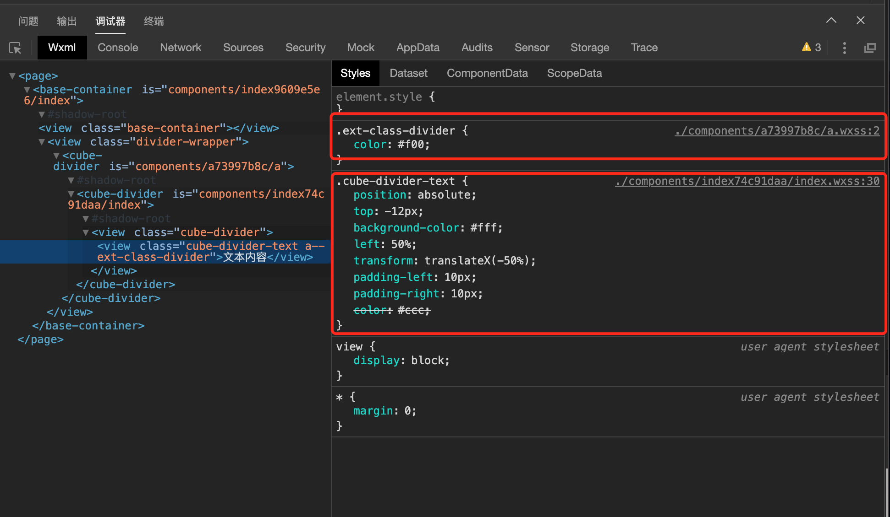
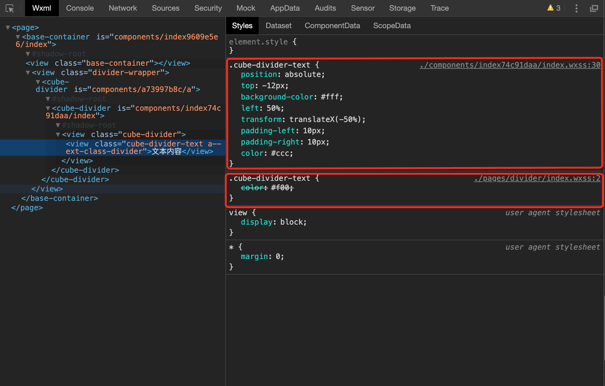

### css-in-js . vs . css-in-css

由于小程序父子组件样式定义的特殊性，大多数场景下用户不一定会采用主题规范的定义，那么在样式覆盖的问题上需要提供一个较为方便、舒适的解决方案。

css-in-css:

方案一：`externalClasses`

方案二：`addGlobalClass`（等价于：`styleIsolation: 'apply-shared'`）

使用`externalClasses`方案需要对组件进行合理的结构拆分。但是还是会存在样式覆盖过程中的样式优先级的权重问题，导致如果不通过 css 选择器来决定样式的权重的话，最终 css 所要呈现的样式并非我们所期望的。

而且`externalClasses`的使用范围受限，只能对这个 class 自身进行样式的约定，不过连这个 class 的伪元素也无法进行设置，同时如果是希望通过 externalClasses 对组件内部的其他 class 进行一些样式覆盖也是不行的。记住一点就是 externalClasses 只能对这一个 class 进行样式的设定。

使用`externalClasses`需要注意的一个地方，`externalClasses`定义的 class 属性的权重值要比组件内部定义的权重值更高。

使用`addGlobalClass`方式的话，就是**在 Page 当中**设置的属性可以影响到组件内部的，也就是在写法上这个组件必须是在 page 当中被使用。如果是 Component 之间相互嵌套的话这个设置是没有任何影响的，不会生效。

使用`addGlobalClass`需要注意的一个地方，在 page 当中定义的 class 属性值(不带任何其他加权后的选择器)的优先级是没有组件内部定义的 class 属性值的权重高的，这样就导致了一个问题，在 page 当中进行复写的属性值是影响不到组件内部的属性定义的。所以需要在 page 当中加大选择器的权重值。(常见的作为就是在组件外部再套一个 view 容器)

css-in-js:

在组件内部提供 custom style 的 props，在父组件的 js 代码中定义好相关的样式代码，通过 props 传入到子组件并完成样式的覆盖。此方式最终为内联样式，因此样式的优先级最高。

小程序的 component 的方案是采用的 web component，因此在样式方面是自带作用域的

### API 设计

1. 微信的原生组件提供了很多属性设置，但是有很多属性其实是比较冗余或者是说比较鸡肋的。例如`Button`组件的`size`属性，对于开放的 web 环境来说，button 标签仅提供最为原始的 css 样式，在微信小程序当中，size 提供了 `small` 的选项配置，但是这个 `small` 的选项配置到底是针对什么样的尺寸配置来作为参照，进而提供这样一个**小**按钮的配置项的？

2. Cube-ui 的部分组件，例如`Toast`、`Dialog`等使用的 createApi 的方式动态创建 DOM 并向文档当中插入新创建的 DOM 节点并调用，但是在小程序里面是没有 DOM 的，因此在使用这些组件的过程当中还是需要通过手动在 template 当中进行申明，然后再 script 当中获取这个组件的 ref 引用并调用其相关 api 进行交互。

3. Cube-ui 和 小程序的事件命名的设计

### 转译型框架 . vs . 增强型框架

在组件库的开发当中，转译型框架可以从最上层进行组件库的统一编写工作。那么在开发组件库的过程中从上层做统一的封装和磨平工作即可。而增强型的框架是基于原生的小程序进行开发，那么在开发小程序的组件库和H5的组件库的时候，需要考虑的问题就比较多了。

### docs

组件库的文档和framework文档的结合

### 主题定制