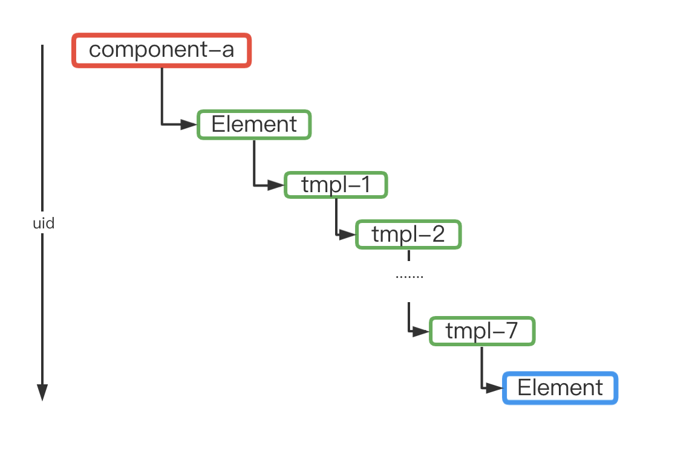

## 核心流程：

1. 编译阶段：收集组件信息(mpx-loader、template-compiler)、生成 render Function、驱动模板引擎生成运行时渲染基础模板(mpx-base-render.wxml)

2. 运行时阶段：render Function 执行生成 vdom tree，驱动完成组件渲染

3. 运行时渲染策略：每个运行时组件都放到 `element` (解决全局注入的问题)自定义组件上下文当中进行渲染。



## 运行时

1. 根据 `uid` 缓存 mpx 实例的上下文（事件、获取 ref）等使用，created 阶段缓存、destory 阶段移除缓存实例；

2. 事件：运行时组件内，统一走 proxy 代理的模式，通过 `mpxuid` 来决定使用的 mpx 上下文实例。
3. 获取 ref：判断是否(`this.mpxCustomElement`)是在 `element` 运行时组件内，如果是则通过 `uid` 获取对应的 mpx 实例上下文，完成 ref 挂载；
4. 运行时组件的 properties -> computed 数据，用以支持 `wx:bind` 增强指令；
5. 页面/组件渲染：对于原有的 render Function 做增强(render helper)，返回一个 vdom tree，驱动编译环节收集生成的基础模板；

(rootUid，uid)

```javascript
__webpack_require__.g.currentInject = {
  moduleId: 'm2b95ba89',
  render: function () {
    var vnode = this.__c(
      'block',
      {
        rootUid:
          this.mpxAttrs && this.mpxAttrs.uid !== undefined
            ? this.mpxAttrs.uid
            : this.__mpxProxy.uid,
        uid: this.__mpxProxy.uid
      },
      [
        this.__c(
          'static-view',
          {
            uid: this.__mpxProxy.uid,
            a: '1'
          },
          [
            this.__c(
              'static-view',
              {
                uid: this.__mpxProxy.uid,
                a: '2'
              },
              [
                this.__c(
                  'static-view',
                  {
                    uid: this.__mpxProxy.uid,
                    a: '3'
                  },
                  [
                    this.__c('c2ba5b48e', {
                      uid: this.__mpxProxy.uid,
                      slots: {
                        default: [
                          this.__c('c2ba5b48e', {
                            uid: this.__mpxProxy.uid,
                            slots: {
                              default: [
                                this.__c('c2ba5b48e', {
                                  uid: this.__mpxProxy.uid,
                                  slots: {
                                    default: [
                                      this.__c('c2ba5b48e', {
                                        uid: this.__mpxProxy.uid,
                                        slots: {
                                          default: [
                                            this.__c(
                                              'view',
                                              {
                                                uid: this.__mpxProxy.uid,
                                                hidden: this.customWrapperData,
                                                dataEventconfigs: {
                                                  tap: [['tapOk']]
                                                }
                                              },
                                              [this.__v('okokook')]
                                            )
                                          ]
                                        }
                                      })
                                    ]
                                  }
                                })
                              ]
                            },
                            a: 'commmmmm',
                            class: 'ref_refCommonOther_2',
                            dataEventconfigs: {
                              commonaevent: [['tapCommonaOther']]
                            }
                          }),
                          this.__c(
                            'static-view',
                            {
                              uid: this.__mpxProxy.uid,
                              a: '6'
                            },
                            [this.__v('this is refView66')]
                          )
                        ]
                      },
                      a: this.customWrapperData,
                      class: 'ref_refCommon_1',
                      dataEventconfigs: {
                        commonaevent: [['tapCommona']]
                      }
                    }),
                    this.__c(
                      'static-view',
                      {
                        uid: this.__mpxProxy.uid,
                        hidden: true,
                        a: '4'
                      },
                      [
                        this.__c(
                          'view',
                          {
                            uid: this.__mpxProxy.uid,
                            a: '5',
                            class: 'ref_refView5_3',
                            dataEventconfigs: {
                              tap: [['tapView']]
                            }
                          },
                          [this.__v('this is refView5')]
                        )
                      ]
                    )
                  ]
                )
              ]
            )
          ]
        )
      ]
    )
    this._r(vnode)
  }
}
```

## 编译阶段：

1. `hooks.thisCompilation` 阶段拓展 mpx 对象上的 `runtimeRender` 以及 `hooks`；
2. `mpx-loader`：resolve 以 `.runtime.mpx` 为后缀的路径，收集组件配置信息，以供 `template-compiler` 编译使用；

3. `template-compiler/index.js`：

根据是否是运行时组件来决定生成 render Function 的内容，以及接下来交由 `wxml-loader` 处理的内容

4. `template-compiler/compiler.js`：

4.1 元素处理流程：

新增：

processRuntime：运行时组件标识 & 注入 computed 数据

processBindProps

postProcessRuntime：节点收集、mpxAttrs 属性添加等

修改：

processBindEvent

processIf/postProcessIf

4.2 render Function 生成：

genElement 方法

5. `runtime-render`：运行时渲染相关。主要是完成节点收集

6. `hooks.finishSubpackagesMake`：分包处理完触发 hooks，如果有使用到运行时组件，那么将 `mpx-custom-element` 加入编译流程

7. `hooks.beforeModuleAssets`：注入 `mpx-custom-element`，动态生成 `mpx-render-base.wxml`

## @mpxjs/template-engine 模板引擎

在编译阶段收集需要被注入到基础模板当中的元素及属性：

```javascript
// @mpxjs/webpack-plugin/runtime-render/inject-component-config.js

module.exports = {
  // 收集自定义组件元素节点
  thirdPartyComponents: new Map(),
  // 收集运行时组件元素节点
  runtimeComponents: new Map(),
  // 收集基础元素(小程序内置组件)节点
  internalComponents: new Map()
}
```

驱动模板引擎生成最终的基础模板。

渲染策略：每个运行时渲染的组件都在 `element` 自定义组件当中进行渲染。每8层 template 之后插入 `element`
