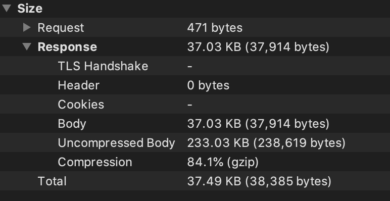
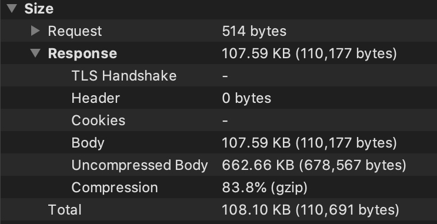

## 美团小程序页面级别全运行时动态化方案剖析

小程序整体还是编译+运行时混合的方案。

美团团购（Caster 动态容器）运行时方案，模拟浏览器环境中集成了 Kbone 来作为 DOM/BOM 的补充实现。

美团外卖（Tango 动态容器）运行时方案，使用 React-reconciler 来作为 DOM/BOM 的补充实现（和 Taro 的方案基本类似）。

从官方分享出来的文章来看的话，在框架设计上应用层应该是自研的一套 R2X DSL，具体的框架内容不得而知。

在由 VNode -> 视图渲染这一环节，**所有的小程序运行时方案基本都一致**：template + custom-component 的递归渲染方式，由 VNode 去驱动视图最终的渲染。

动态化的基座：可以理解为基础模板。 -> 和原生小程序的集成

页面渲染流程：

`DD`（美团内部自研移动端动态下发平台）， `Portm` 动态数据分发平台，所以数据结构一致：

```javascript
Interface API {
  dom: object // vTree 结构
  jscode: array // js ast
  json: unknow
  wxs_mode: array
  style: array // 样式表
  snap: string // 快照
  dep: Record<string, API> // 页面与组件、组件与组件之间的依赖关系
  hash: string
  expire: num
  v: v8
}

Interface Dom {
  tag: string // 模块标签
  attr: object // 属性
  children: Array<Dom> // 子节点
  template?: object
  wxs?: object
}
```

Tango：

> https://portal-portm.meituan.com/weapp/dynamic/v6/pay-finance-cashier__3.1.4__gray/cashier-page



Caster：

> https://portal-portm.meituan.com/weapp/dynamic/v6/meituanpaotui__2.61.2__prod/pages-index-index



## Template 设计

基础模板类型：

- wx-body
- wx-view
- wx-text
- wx-slot
- wx-block
- wx-button
- wx-image
- wx-template
- wx-dynamic

vTree 当中使用的这些模板类型最终是和基础模板（也就是上文提到的基座）一一匹配的。举个简单的例子：

```javascript
// wx-view 为定义的模板名，实际在渲染过程当中是渲染的 view 这个基础组件
<template name="wx-view">
  <view>
    <block wx:for="{{i}}">
      <template name="xxx"></template>
    </block>
  </view>
</template>
```

这里面有个比较有意思的模板名叫 `wx-dynamic`，这个模板从字面意思上就知道是动态的，其实也就是承接了**自定义组件的渲染**。**在全运行时方案的设计当中，基本上是摆脱了小程序自定义组件的概念和用法，而是采用了应用层（例如 vue、react 等上层应用框架）的组件概念，组件的一切生命周期及渲染、交互流程都是交给应用层来控制**。

让我们从接口数据层面来分析下 `wx-dynamic` 这个承接了自定义组件渲染的模板是怎么工作的。

```
{
  "tag": "wx-dynamic",
  "attr": {
  	"case": "bonus-pay-type",
  	"bonus": {
  		"type": "exp",
  		"value": [{
  			"type": "ast",
  			"value": [2, "bonus"]
  		}]
  	},
  	"selectedWX": {
  		"type": "exp",
  		"value": [{
  			"type": "ast",
  			"value": [35, "===", [2, "selectedPayType"],
  				[2, "WX_JSPAY"]
  			]
  		}]
  	}
  },
  "children": []
  }
```

这个自定义组件接收3个 props：`case`、`bonus`、`selectedWX`，其中 `case` 这个纯静态的属性表示需要渲染的子组件名，另外2个属性是在模板编译的过程中把他们识别为了表达式（即**需要在运行时动态计算**）。那么 `bonus-pay-type` 这个子组件的具体定义是什么呢？

```javascript
...
```

可以清楚的看到这个组件的 `dom`(vtree)、`jscode`(逻辑)、`style`(样式)以及这个组件是没有其他的 `dep`(依赖)的。在上文我也说过，全运行时方案的组件是在应用层的框架去接管的，那么在构建整个页面的过程当中。

## vTree 设计

todo: 自定义组件是怎么渲染的呢？

## Style 设计

每一条的样式规则通过 `CSSOM` 来进行描述：

case 1:

```javascript
{
  "_sel": ".order-fee text",
  "selector": [{
  	"type": "attribute",
  	"name": "class",
  	"action": "element",
  	"value": "order-fee",
  	"ignoreCase": false
  }, {
  	"type": "descendant"
  }, {
  	"type": "tag",
  	"name": "text"
  }],
    "cssText": "font-size: 48rpx; color: #111; line-height: 48rpx; margin-right: 6rpx;",
    "i": 6
  }
```

case 2:

```javascript
{
  "_sel": ".item-bank-info > image",
  "selector": [{
  	"type": "attribute",
  	"name": "class",
  	"action": "element",
  	"value": "item-bank-info",
  	"ignoreCase": false
  }, {
  	"type": "child"
  }, {
  	"type": "tag",
  	"name": "image"
  }],
    "cssText": "width: 32rpx; height: 32rpx; margin-right: 12rpx; display: inline-block; vertical-align: middle;",
    "i": 11
  }
```

case 3:

```javascript
{
  "_sel": ".checked .item-bank-info > span",
  "selector": [{
  	"type": "attribute",
  	"name": "class",
  	"action": "element",
  	"value": "checked",
  	"ignoreCase": false
  }, {
  	"type": "descendant"
  }, {
  	"type": "attribute",
  	"name": "class",
  	"action": "element",
  	"value": "item-bank-info",
  	"ignoreCase": false
  }, {
  	"type": "child"
  }, {
  	"type": "tag",
  	"name": "span"
  }],
  "cssText": "position: absolute; top: 50%; right: 30rpx; margin-top: -20rpx; width: 44rpx; height: 44rpx; background: url(data:image/png;base64,iVBORw0KGgoAAAANSUhEUgAAADYAAAA2CAYAAACMRWrdAAAAAXNSR0IArs4c6QAABAhJREFUaAXtl1uIVlUUx//b8ZL3C4YiopCQICjiBaIIFUsGR5QImfBBIh/yguaoFWGRgr6Il2xUSHpI8YbkSKOhE002kIIogvrim+AF0heNaNK8bH/74JGv495nvm++uXwP+7ycc9baZ+31W2vttfeR4hUjECMQIxAjECMQIxAjECMQI+CPgPGLK0tqv9F0PdZOGU3Esyuq0mqzWhfyvKx4MLtNs2V10kqvpCA4fU99NcGs0J+pLHvvkRVU0rvdrrfxp7EQyvnH+1D9q/l5vvbMU3anjky9oaf6GYh+7fGjIsHsVk0lLaeBGuiDMkb3KcxGny6VVVwp0igm0SR+AWpw6mThHaiHQH+Qt77c+IoCs99qgp7oV2s1rBAmfQbqEdALzTo1pbLQvWK6ImvqdTLRQqZG+pwF6gnyWrNWx3z6rKwiMmZ36DWgmoNQoo0YLS4WykF2O5jdqTHk4jegRmej7t7JlAVqiVmjQz59SNatYLZeo1g1DmpsyEHky8jUDzl6r6qodk+nGsHX49VH18wy3fVaKlGY2HyYQI0LfUoDWAXUdyF9nrzNjLH713FOu2Efq0WtusUi/zzPYDE69qnhlJ9bU+ND400PfUb3qw/p25LndkUW9RSW7UXa7//GUfcbieSGtoz79HYPx6HWJFOTfXonA+or1tSmkL4YeX7GrGZkoZxRZF+TyU+LmaBwDPvUIKCayFQYymhzuVBuznww6XahY4XP9qm2ALe8UJb3bHdrAI3iFFDTQ+OohK1UwpchfSnyfLD+Os5kl4MGrXax5j4M6p8rCEBfTuMnyPSbobHMUw9UyVUQspcLZj5OjjA1LLDrPgPPy/R74Gp9eiej/PqwE/1EpmaGxmB/r9bok5C+PfJcMGeQer+Na7OZ/JZvAuCqcPwAcC/9H9mj6q3/dIwx7/q+TexL+7RWS8kY7B13tQmWTL6SjPXUO0x+xzc1Hrn98Cht/AWAPYPspo6gq/F9k9g1OgzURx0NldgOTeqTs1YmEtffyUDo9N3KxlDN4egcUAcZFyxRKqCBv65aM4tdshMu7Jd2ATcNuGacHuT7EoN/A9eCfp5P72SMOcEv5PvJGg4NKlNeMpibj437LU4Obj/qX+r8lF2TemmBWcUPYydeRa2x7PymTmcJ+wKi8iCry3sH6gzfvdfZUM6HdmUsdZ5O6MqtgbLrlcpCd6D+0KuqNov1T2hMR8rblbHUATbUk5xdFuG0+7sNXkTvvIZobldBOUfKAnMGKMsfuQVbNtCX2OmqzRKaShdeZYM5X8ncfor6pXMjUFfZ3OcAf78LmZKpylpjWWfpljUU5Xog3Y9pE8feL2jpf2XHxfcYgRiBGIEYgRiBGIEYgRiBGIEYgU6IwDNv+v+vQdWpKAAAAABJRU5ErkJggg==) no-repeat; background-size: 100% 100%;",
  "i": 13
  }
```

不同于 web 技术，你可以动态创建一个 `style` 标签，然后将 css 文本样式直接注入到这个 `style` 标签当中然后出入文档即可生效，但是对于小程序而言肯定是无法直接使用这些css字符串的，你只能通过提供 `wxss` 文件，交由小程序的编译系统构建打包之后上线，所以也就只能走这种静态编译的手段。

对于整个技术方案来说，有关样式的处理也是让我非常好奇的。这里其实可以联想一下 [web 场景下的渲染流程](https://developer.mozilla.org/zh-CN/docs/Web/Performance/How_browsers_work)：渲染器首先会构建 DOM Tree 和 CSSOM Tree，然后组合成一个 Render Tree，这个 Render Tree 其实就是在遍历 DOM Tree 过程中去匹配 CSSOM Rule，然后在进行后面的 Layout 等阶段。

那么对应到小程序的小程序的方案当中，是否也是采用和 web 技术同样的方案？在 jsvm 当中去解析执行 DOM Tree(vTree) 和 CSSOM，最终去生成一个 Render Tree，这个时候 dom 节点已经匹配找到对应的样式文本(`cssText`)了，这里的样式文本是通过 inline css 这种方式去作用于 dom 节点的，接下来这个 Render Tree 再借助 template 递归渲染完成这个页面/组件的渲染工作。

如果是采用的这种方式，那么我会有几个疑惑点，例如：

* 为什么没有在编译阶段去做 DOM Tree 和 CSSOM 的匹配工作，而是在客户端的 jsvm 去做这个工作，这种方式肯定会带来一定的性能损耗的；

猜测是因为有些 class 类是需要在运行时确认的，所以这部分的匹配工作不能在编译环节去做，只能是在运行时阶段去动态匹配。

在 Caster 的方案设计当中，对于 Style 这块的处理和 Tango 方案不同的地方是，没有在编译阶段去做 CSSOM 的生成工作，而是直接将最终的样式表返回给了客户端。那么如果是基于 Render Tree 进行渲染的话，那在流程当中会多出一步构建 CSSOM 以及匹配的 DOM Tree 的工作，同样会有一部分的性能损耗。

todo: 补一个 Caster 的图


todo：还有一种方式，web component 提供了设置样式的API？待调研

当然对于全运行时方案来说有个样式覆盖的问题需要注意。

## Js code

有关 Js code，也就是页面/组件的逻辑层的代码，这块应该是在编译阶段直接处理为了 AST 对应到接口数据当中的 `jscode`，然后在小程序运行的时候交由 jsvm 去执行，在 jsvm 设计方面使用了** OpCode 去优化 js str 的执行性能，同时也保护了 js 代码的安全性**。

另外就是单独说下 js str 的执行过程，通过分析返回的数据内容可以看到需要被动态执行的主要包含2部分的内容：

* 组件的逻辑层；
* 组件的 vtree 当中涉及到表达式的内容；

这2块也比较好理解，动态化的方案本身的一个工作就是动态的执行 js 代码

模块设计，所有的模块都单独编译打包，包括纯 js 代码，例如工具函数 utils 等，一个小程序的组件就打包为 `interface API`


## modules-page/modules-customComponent 设计

在 Caster 当中，modules-page 和 modules-customComponent 分别承载了页面/组件的渲染，可以理解为对于原生的小程序 Page/Component 做了一层包装

而在 Tango 当中，没有对构造函数做包装，直接使用 Page/Component 构造函数

## Mach 容器

R2X -> 小程序语法（模板、逻辑）

克服了Mach容器渲染机制的约束（运行时与虚拟DOM的使用限制）。 VNode -> 渲染有性能问题。数据量大（具体可参阅 Taro 相关的渲染优化的点）

那么基于原生小程序的动态化的方案可以怎么做呢？

1. 渲染问题；
2. 逻辑执行的问题；

jsvm 执行 bundlejs 之后，返回的数据是什么？

```javascript
// 也是一个自定义组件
<module-container></module-container>
```

## 整体流程

## 性能

- [美团外卖终端容器无关化研发框架](https://tech.meituan.com/2021/11/11/meituan-waimai-containerless-framework.html)


组件的渲染
组件的逻辑执行