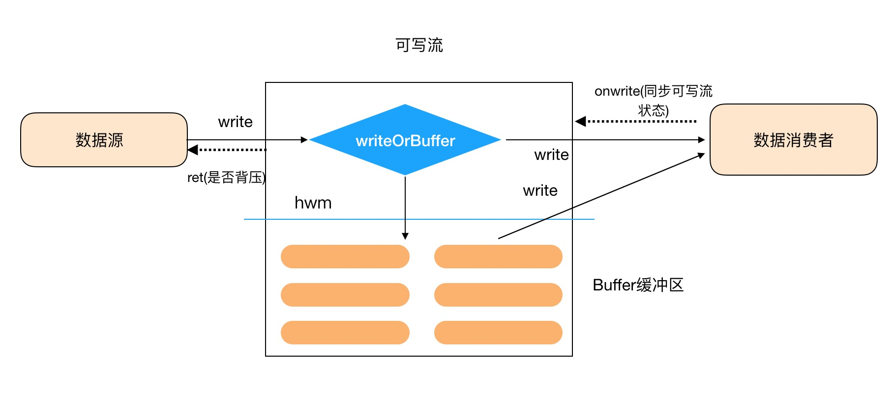

## Node.js Writable Stream的实现简析

可写流是对数据写入“目的地”的一种抽象，可作为可读流的一种消费者。数据源可能多种多样，如果使用了可写流来完成数据的消费，那么就有可写流的内部机制来控制数据在生产及消费过程中的各状态的扭转等。



首先来看下可写流内部几个比较关键的状态：

```javascript
function WritableState(options, stream) {
  options = options || {};

  // Duplex streams are both readable and writable, but share
  // the same options object.
  // However, some cases require setting options to different
  // values for the readable and the writable sides of the duplex stream.
  // These options can be provided separately as readableXXX and writableXXX.
  var isDuplex = stream instanceof Stream.Duplex;

  // object stream flag to indicate whether or not this stream
  // contains buffers or objects.
  this.objectMode = !!options.objectMode;

  if (isDuplex)
    this.objectMode = this.objectMode || !!options.writableObjectMode;

  // the point at which write() starts returning false
  // Note: 0 is a valid value, means that we always return false if
  // the entire buffer is not flushed immediately on write()
  var hwm = options.highWaterMark;
  var writableHwm = options.writableHighWaterMark;
  var defaultHwm = this.objectMode ? 16 : 16 * 1024;

  if (hwm || hwm === 0)
    this.highWaterMark = hwm;
  else if (isDuplex && (writableHwm || writableHwm === 0))
    this.highWaterMark = writableHwm;
  else
    this.highWaterMark = defaultHwm;

  // cast to ints.
  this.highWaterMark = Math.floor(this.highWaterMark);

  // if _final has been called
  this.finalCalled = false;

  // drain event flag.
  this.needDrain = false;
  // at the start of calling end()
  this.ending = false;
  // when end() has been called, and returned
  this.ended = false;
  // when 'finish' is emitted
  this.finished = false;

  // has it been destroyed
  this.destroyed = false;

  // should we decode strings into buffers before passing to _write?
  // this is here so that some node-core streams can optimize string
  // handling at a lower level.
  var noDecode = options.decodeStrings === false;
  this.decodeStrings = !noDecode;

  // Crypto is kind of old and crusty.  Historically, its default string
  // encoding is 'binary' so we have to make this configurable.
  // Everything else in the universe uses 'utf8', though.
  this.defaultEncoding = options.defaultEncoding || 'utf8';

  // not an actual buffer we keep track of, but a measurement
  // of how much we're waiting to get pushed to some underlying
  // socket or file.
  // 不是真实buffer的长度，而是等待被写入文件或者socket等的数据的长度
  this.length = 0;

  // a flag to see when we're in the middle of a write.
  this.writing = false;

  // when true all writes will be buffered until .uncork() call
  this.corked = 0;

  // a flag to be able to tell if the onwrite cb is called immediately,
  // or on a later tick.  We set this to true at first, because any
  // actions that shouldn't happen until "later" should generally also
  // not happen before the first write call.
  this.sync = true;

  // a flag to know if we're processing previously buffered items, which
  // may call the _write() callback in the same tick, so that we don't
  // end up in an overlapped onwrite situation.
  this.bufferProcessing = false;

  // the callback that's passed to _write(chunk,cb)
  // onwrite偏函数，stream始终作为一个参数
  this.onwrite = onwrite.bind(undefined, stream);

  // the callback that the user supplies to write(chunk,encoding,cb)
  this.writecb = null;

  // the amount that is being written when _write is called.
  this.writelen = 0;

  // 缓存池中的头结点
  this.bufferedRequest = null;
  // 缓存池中的尾结点
  this.lastBufferedRequest = null;

  // number of pending user-supplied write callbacks
  // this must be 0 before 'finish' can be emitted
  this.pendingcb = 0;

  // emit prefinish if the only thing we're waiting for is _write cbs
  // This is relevant for synchronous Transform streams
  this.prefinished = false;

  // True if the error was already emitted and should not be thrown again
  this.errorEmitted = false;

  // count buffered requests
  this.bufferedRequestCount = 0;

  // allocate the first CorkedRequest, there is always
  // one allocated and free to use, and we maintain at most two
  var corkReq = { next: null, entry: null, finish: undefined };
  corkReq.finish = onCorkedFinish.bind(undefined, corkReq, this);
  this.corkedRequestsFree = corkReq;
}
```

在实现的可写流当中必须要定义一个`write`方法，在可写流内部，这个方法会被赋值给一个内部`_write`方法，主要是在数据被消费的时候调用：

```javascript
const { Writable } = require('stream')

const ws = new Writable({
  write (chunk, encoding, cb) {
    // chunk 即要被消费的数据
    // encoding为编码方式
    // cb为内部实现的一个onwrite方法，上面说的状态定义里面有关于这个说明，主要是在完成一次消费后需要手动调用这个cb方法来扭转内部状态，下面会专门讲解这个方法
  }
})
```

可写流对开发者暴露了一个`write`方法，这个方法用于接收数据源的数据，同时来完成数据向消费者的传递或者是将数据暂存于缓冲区当中。

让我们来看下一个简单的例子：

```javascript
function writeOneMillionTimes(writer, data, encoding, callback) {
  let i = 1000000;
  write();
  function write() {
    let ok = true;
    do {
      i--;
      if (i === 0) {
        // 最后 一次
        writer.write(data, encoding, callback);
      } else {
        // 检查是否可以继续写入。 
        // 这里不要传递 callback， 因为写入还没有结束！ 
        ok = writer.write(data, encoding);
      }
    } while (i > 0 && ok);
    if (i > 0) {
      // 不得不提前停下！
      // 当 'drain' 事件触发后继续写入  
      writer.once('drain', write);
    }
  }
}

const { Writable } = require('stream')
const ws = new Writable({
  write (chunk, encoding, cb) {
    // do something to consume the chunk
  }
})

writeOneMillionTimes(ws, 'aaaaaa', 'utf8', function () {
  console.log('this is Writable')
})
```

程序开始后，首先可写流调用`writer.write`方法，将数据`data`传入到可写流当中，然后可写流内部来判断将数据是直接提供给数据消费者还是暂时先存放到缓冲区。

```javascript
Writable.prototype.write = function (data, encoding, callback) {
  var state = this._writableState;
  // 是否可向可写流当中继续写入数据
  var ret = false;
  var isBuf = !state.objectMode && Stream._isUint8Array(chunk);

  // 转化成buffer
  if (isBuf && Object.getPrototypeOf(chunk) !== Buffer.prototype) {
    chunk = Stream._uint8ArrayToBuffer(chunk);
  }

  // 对于可选参数的处理
  if (typeof encoding === 'function') {
    cb = encoding;
    encoding = null;
  }

  // 编码
  if (isBuf)
    encoding = 'buffer';
  else if (!encoding)
    encoding = state.defaultEncoding;

  if (typeof cb !== 'function')
    cb = nop;

  // 如果已经停止了向数据消费者继续提供数据
  if (state.ended)
    writeAfterEnd(this, cb);
  else if (isBuf || validChunk(this, state, chunk, cb)) {
    state.pendingcb++;
    // 是将数据直接提供给消费者还是暂时存放到缓冲区
    ret = writeOrBuffer(this, state, isBuf, chunk, encoding, cb);
  }

  return ret;
}

function writeOrBuffer (stream, state, isBuf, chunk, encoding, cb) {
  ...
  var len = state.objectMode ? 1 : chunk.length;

  state.length += len;

  var ret = state.length < state.highWaterMark;
  // we must ensure that previous needDrain will not be reset to false.
  // 如果state.length长度大于hwm，将needDrain置为true，需要触发drain事件，开发者通过监听这个事件可以重新恢复可写流对于数据源的获取
  if (!ret)
    state.needDrain = true;

  // state.writing 代表现在可写流正处于将数据传递给消费者使用的状态
  // 或 当前处于corked状态时，就将数据写入buffer缓冲区内
  // writeable的buffer缓冲区也是链表结构
  if (state.writing || state.corked) {
    var last = state.lastBufferedRequest;
    state.lastBufferedRequest = {
      chunk,
      encoding,
      isBuf,
      callback: cb,
      next: null
    };
    if (last) {
      last.next = state.lastBufferedRequest;
    } else {
      state.bufferedRequest = state.lastBufferedRequest;
    }
    state.bufferedRequestCount += 1;
  } else {
    // 将数据写入底层数据即传递给消费者
    doWrite(stream, state, false, len, chunk, encoding, cb);
  }

  return ret;
}


function doWrite(stream, state, writev, len, chunk, encoding, cb) {
  // chunk的数据长度
  state.writelen = len;
  // chunk传递给消费者后的回调函数
  state.writecb = cb;
  // 可写流正在将数据传递给消费者的状态
  state.writing = true;
  // 同步态
  state.sync = true;
  // 如果定义了writev批量写入数据数据的就调用此方法
  if (writev)
    stream._writev(chunk, state.onwrite);
  else
  // 这个方法即完成将数据传递给消费者，并传入onwrite回调，这个onwrite函数必须要调用来告知写数据是完成还是失败
  // 这3个参数也对应着上面提到的在自定义实现可写流时需要定义的write方法所接受的3个参数
  // 可写流向消费者提供数据是同步的，但是消费者拿到数据后同步可写流的状态可能是同步，也可能是异步的
    stream._write(chunk, encoding, state.onwrite);
  state.sync = false;
}
```

在`doWrite`方法中调用了开发者定义的`write`方法来完成数据的消费，即`stream._write()`，同时也提到了关于当数据被消费完了后需要调用`state.onwrite`这个方法来同步可写流的状态。接下来就来看下这个方法的内部实现：

```javascript
// 完成一次_write方法后，更新相关的state状态
function onwriteStateUpdate(state) {
  state.writing = false;  // 已经写完数据
  state.writecb = null;   // 回调
  state.length -= state.writelen;
  state.writelen = 0;     // 需要被写入数据的长度
}

// 数据被写入底层资源后必须要调用这个callback，其中stream是被作为预设函数，可参数上面Writeable中关于onwrite的定义
function onwrite(stream, er) {
  var state = stream._writableState;
  var sync = state.sync;
  var cb = state.writecb;

  // 首先更新可写流的状态
  onwriteStateUpdate(state);

  if (er)
    onwriteError(stream, state, sync, er, cb);
  else {
    // Check if we're actually ready to finish, but don't emit yet
    // 检验是否要结束这个writeable的流
    var finished = needFinish(state);

    // 每次写完一次数据后都需要检验
    // 如果finished代表可写流里面还保存着有数据，那么需要调用clearBuffer，将可写流的缓冲区的数据提供给消费者
    if (!finished &&
        !state.corked &&
        !state.bufferProcessing &&
        state.bufferedRequest) {
      clearBuffer(stream, state);
    }

    // 始终是异步的调用afterWrite方法
    if (sync) {
      process.nextTick(afterWrite, stream, state, finished, cb);
    } else {
      afterWrite(stream, state, finished, cb);
    }
  }
}

function afterWrite(stream, state, finished, cb) {
  if (!finished)
    onwriteDrain(stream, state);
  state.pendingcb--;
  cb();
  finishMaybe(stream, state);
}

// 是否要结束这个writeable的流，需要将内部缓冲区的数据全部写入底层资源池
function needFinish(state) {
  return (state.ending &&
          state.length === 0 &&
          state.bufferedRequest === null &&
          !state.finished &&
          !state.writing);
}

// if there's something in the buffer waiting, then process it
// 内部递归调用doWrite方法来完成将数据从缓冲区传递给消费者
function clearBuffer(stream, state) {
  // 这个字段代表正在处理缓冲区buffer
  state.bufferProcessing = true;
  var entry = state.bufferedRequest;

  // 在定义了writev方法的情况下才可能调用，批量将数据传递给消费者
  if (stream._writev && entry && entry.next) {
    // Fast case, write everything using _writev()
    ...
  } else {
    // Slow case, write chunks one-by-one
    // 一个一个将数据传递给消费者
    while (entry) {
      var chunk = entry.chunk;
      var encoding = entry.encoding;
      var cb = entry.callback;
      var len = state.objectMode ? 1 : chunk.length;

      // 继续将缓冲区的数据提供给消费者
      doWrite(stream, state, false, len, chunk, encoding, cb);
      entry = entry.next;
      state.bufferedRequestCount--;
      // if we didn't call the onwrite immediately, then
      // it means that we need to wait until it does.
      // also, that means that the chunk and cb are currently
      // being processed, so move the buffer counter past them.
      if (state.writing) {
        break;
      }
    }

    if (entry === null)
      state.lastBufferedRequest = null;
  }

  state.bufferedRequest = entry;
  // 缓冲区buffer已经处理完
  state.bufferProcessing = false;
}
```

每次调用`onWrite`方法时，首先都会调用`onwriteStateUpdate`方法来更新这个可写流的状态，具体见上面的方法定义。同时需要对这个可写流进行判断，是否要关闭这个可写流。同时还进行判断`buffer`是否还有可供消费者使用的数据。如果有那么就调用`clearBuffer`方法用以将缓冲区的数据提供给消费者来使用。


## 背压

当数据源提供给可写流的数据过快的时候有可能出现背压的情况，这个时候数据源不再提供数据给可写流，是否出现背压的情况，可通过可写流的`write`方法的返回值来进行判断，如果返回的是`false`，那么就出现的了背压。

[参见这个例子](https://github.com/CommanderXL/study/blob/master/node/stream/writeable_back_press.js)在实现的`write`方法中通过`setTimeout`来延迟一段时间调用`onwrite`方法，这个时候每次数据消费者都拿到了数据，但是因为这个地方延迟了更新可写流的状态，但是从数据源向可写流中还是同步的写入数据，因此可能会出现在可写流的缓冲区保存的数据大于`hmw`的情况。

在`writeOrBuffer`方法中有关于可写流缓冲区保存的数据长度和`hwm`的比较:

```javascript
var ret = state.length < state.highWaterMark;
// we must ensure that previous needDrain will not be reset to false.
// 如果state.length长度大于hwm，将needDrain置为true，可能需要触发drain事件，
if (!ret)
  state.needDrain = true;
```

将`needDrain`置为`true`。出现背压后，数据源不再提供数据给可写流，这个时候只有等可写流将缓冲区的所有完成全部提供给消费者消耗，同时更新完可写流的状态后，会触发一个`drain`事件。

```javascript
function onwrite(stream, er) {
  ...
  if (er)
    ...
  else {
    ...

    if (sync) {
      process.nextTick(afterWrite, stream, state, finished, cb);
    } else {
      afterWrite(stream, state, finished, cb);
    }
  }
}

function afterWrite(stream, state, finished, cb) {
  if (!finished)
    onwriteDrain(stream, state);
  state.pendingcb--;
  cb();
  finishMaybe(stream, state);
}

// 缓冲区的数据已经全部提供给消费者，同时needDrain被置为了true 触发drain事件
function onwriteDrain(stream, state) {
  if (state.length === 0 && state.needDrain) {
    state.needDrain = false;
    stream.emit('drain');
  }
}
```


这个时候如果你的程序提前定义的监听`drain`事件的方法，那么可以在回调里面再次调用可写流的`write`方法来让数据源继续提供数据给可写流。


