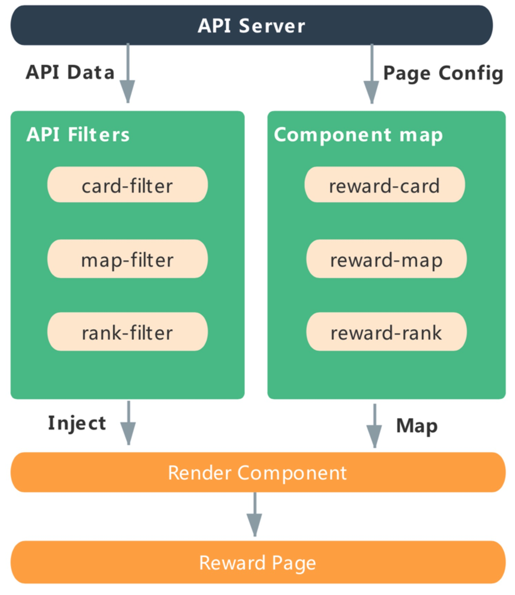

## 奖励活动配置化

---

在去年下半年有做一个项目重构，是面向司机的奖励活动。奖励活动一共分为多个类别，每种奖励活动有公共的业务组件，也有每种活动独有的业务组件，所有的奖励活动详情页面都是由上至下的排列布局方式，不过有些公共组件在不同页面的布局位置存在差异，所有这几类奖励活动页面都是偏展示，而轻交互。在具体的重构过程中，对于这一块的页面整体采用了配置化的页面渲染方式：

1. 弱化页面的概念，将不同的活动页面进行合理的组件拆分，前端不再有具体的活动类型页面
2. 将不同的奖励活动页面收敛至一个单独的由 Render Component 来完成渲染的页面
3. 由前端维护一份组件映射全集
4. 对于每个组件将数据层和视图层尽可能的拆解出来

重构后项目的工作流如上图：

用户进入到活动页面，由 API 下发接口数据（API Data）和需要渲染当前页面所需要的页面 JSON 配置（Page Config）。前端自身维护了一份组件映射全集，同时每个组件都对应一个 API-filter 模块，当接收到了接口数据后，根据 JSON 配置经由不同组件的 API-filter 模块完成过滤，最终将过滤好的数据以及需要的组件配置注入到一个 Render Component 当中，去完成最终的页面渲染。通过这次重构后，再有新增奖励活动的页面，只需要进行新增组件的开发，对前端组件映射表进行拓展，再更新后端下发的页面配置数据即可完成一个新的活动页面的开发，最终从开发到上线的时间有了大幅的缩短。